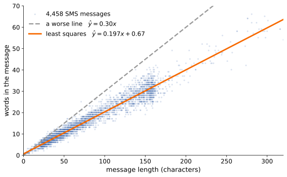
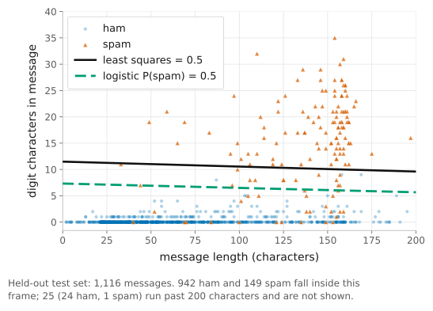
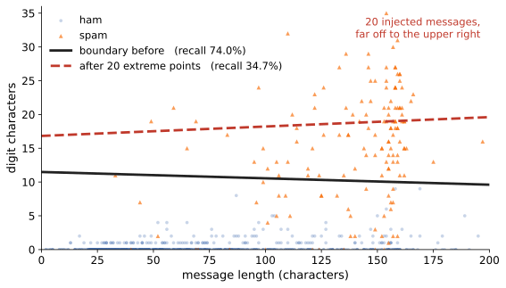
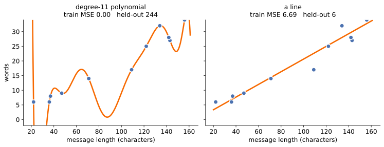
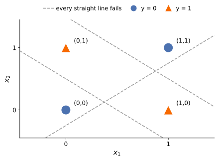
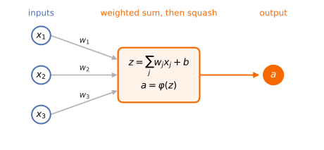

<!-- title: ML Introduction -->
<!--
  ============================================================================
  DECK:   ML Introduction
  UNIT:   Week 2 (Tu 9/1) — ONE 80-minute session. Intro to ML only:
          the LLM teaser was cut and belongs to a later session.
  FOLDER: 03-ml-background
  ============================================================================
  DESIGN CONTRACT for this deck (revised by the instructor, Aug 2026).

  This contract deliberately REPLACES the earlier one, which called this the
  "gentle background day," allowed "a handful of core formulas, zero
  derivations," and forbade pulling math back from the reference decks. That
  version undersold the course. This is the standard now.

  WHAT THIS DECK IS: a rigorous first pass at supervised learning. Real math,
  real numbers, real runnable PyTorch. Every quantity printed on a slide was
  computed on the real corpus before it was written down; nothing here is
  illustrative-only. If a number appears on a slide, it reproduces.

  - ONE running dataset for the whole deck: the UCI SMS Spam Collection that
    already ships with the paired lab, at
    labs/spam-classification/data/SMSSpamCollection — 5,574 real messages,
    747 spam / 4,827 ham, a 13.4% base rate, split with base.SEED = 400 into
    4,458 train / 1,116 test. Slide CODE is self-contained — hand-picked real
    messages written out as a literal tensor, no loader import — because
    students cannot see spam_lab from a slide. The paired lab uses the same
    corpus and split, so lecture and lab still line up.
  - ONE framework: PyTorch, uniformly. Every code block is torch or plain
    tensors. No sklearn, no NumPy-only snippets, no pseudo-API.
  - The spine is a MODEL LADDER climbed on that one dataset:
      least squares in closed form (the normal equations)
        -> least squares USED AS a classifier
        -> where that breaks: arbitrary thresholds, outlier drag, scores
           outside 0..1
        -> logistic regression (convex, no closed form, descent)
        -> softmax and cross-entropy, the multiclass generalization
        -> one-hot encoding, and bag of words as a sum of one-hots
        -> the linear wall (XOR), proved, not asserted
        -> a neuron, and why the nonlinearity is load-bearing
        -> a hidden layer, depth vs width, and honest parameter counts.
  - The CLOSED-FORM vs ITERATIVE thread is woven THROUGH that ladder and is
    never announced as its own slide. Squared loss plus a linear model gives
    the normal equations and an exact answer; change EITHER the loss (to
    cross-entropy) OR the model class (to a network) and the stationarity
    condition stops being a linear system, so you descend. And even where the
    closed form exists it can be the wrong tool: at 2,000 bag-of-words
    features X^T X is singular (rank 1958 of 2001, with one verbatim-repeated
    spam template supplying four identical columns), the solve is O(d^3), and
    an unpivoted QR raises nothing while returning garbage. On XOR the closed
    form exists, is cheap, and is worthless. Three distinct failure modes.
  - HONESTY RULE. Where a measured result embarrasses the story, the slide
    says so. On this corpus the hidden layer does not beat logistic
    regression (98.57 vs 98.48, about one message out of 1,116); the
    least-squares/logistic recall gap is calibration, not ranking (test AUC
    0.9737 vs 0.9735); nine parameters suffice for XOR but descent finds them
    from only 16 of 100 seeds. The hype filter points inward too.

  DIVISION OF LABOUR — keep these boundaries, they are the course arc:
    HERE, Week 2  -> supervised learning; losses; closed form vs descent;
                     logistic regression; softmax and cross-entropy; one-hot
                     and bag of words; the linear wall; the NEURON; why
                     nonlinearity is load-bearing; what DEPTH means and what
                     it costs in parameters; evaluation discipline (held-out
                     data, base rates, cost-weighted thresholds). It ends at the
                     recap. There is no LLM content in this deck.
    STOP LINE     -> this deck stops short of the multilayer perceptron as a
                     TRAINED object. It builds networks by hand, runs them,
                     collapses them, and counts their parameters. It never
                     derives a gradient of one and never teaches training
                     dynamics. The MLP test numbers that do appear are the
                     paired lab's own run, quoted as a baseline.
    Week 8        -> multilayer perceptrons, BACKPROPAGATION, training
                     dynamics, and ML-based intrusion detection
                     (slides/06b-neural-networks). When a student asks how
                     the gradients are computed, name Week 8 and move on.
    Week 9        -> adversarial examples and evasion
                     (slides/07-adversarial-ml-network).
    Weeks 10-11   -> language models entirely: tokens, attention, training,
                     agents. Nothing about them belongs in this deck.
    Weeks 12-14   -> attacks on AI systems, and defenses.
  - The optional full-math reference decks (slides/03-ml-llm-crash-course and
    slides/03b-ml-llm-details) and the interactive notes
    (notes/03-ml-llm-crash-course) remain the deeper WRITTEN treatment:
    matrix calculus, the backprop derivation, LLM internals. Point there. But
    a derivation MAY now live in this deck when it earns its place, but it has
    to fit on the slide. SLIDE BUDGET: 44, and vertical sub-slides are banned —
    the instructor counts them in the total, so overflow is not a place to
    hide. New material means cutting old material.

  PACING: one session, ending at the "Today in one screen" recap. There is no
  LLM teaser in this deck any more; language models arrive later in the course.

  After any edit:  node slides-infra/build.mjs slides/03-ml-background
  Validate every equation:  node slides-infra/validate-math.mjs
  Slide syntax: "---" new slide; "Note:" speaker notes. Do not use "--".
  Math: KaTeX between single or double dollars. Slide classes go in an HTML
  comment on the slide's first line, of the form  .slide: class=title-slide
  (also section-divider, big-point).
  ============================================================================
-->
<!-- .slide: class="title-slide" -->

# Intro to ML

## CIS400 &middot; Fall 2026 &middot; Kristopher Micinski

Note:
Open cold and start. One session, one dataset, one framework; the framing
lands better once they have seen a model fitted than as a promise up front.

---

## What is "learning?"

Given examples of inputs and the answers we wanted,

<span class="ktx" data-d="1" data-tex="ICh4XzEsIHlfMSksXCAoeF8yLCB5XzIpLFwgXGRvdHMsXCAoeF9uLCB5X24pLCA="></span>

**fit a function** <span class="ktx" data-tex="Zl9cdGhldGE="></span> so that <span class="ktx" data-tex="Zl9cdGhldGEoeCkgXGFwcHJveCB5"></span> — *on future
inputs*, not just the examples.

- <span class="ktx" data-tex="eA=="></span> — the input: an email, a network packet, a house's square footage.
- <span class="ktx" data-tex="eQ=="></span> — the answer: spam or not, attack or benign, the sale price.
- <span class="ktx" data-tex="XHRoZXRh"></span> — the knobs we get to turn. **The settings of the knobs are "the model."**

Note:
Keep it this concrete. "Machine learning" is curve fitting with many knobs:
choose a family of functions, score how wrong each candidate is on examples,
and search for the settings that are least wrong. The one subtlety worth
stressing today is the word "future": memorizing the examples is trivial and
useless; the entire game is doing well on inputs you have not seen — and that
gap is where both overfitting and attackers live.

---

## The simplest model: a line

**Linear regression.** Predict a number as a weighted sum of the input
features plus an offset:

<span class="ktx" data-d="1" data-tex="IFxoYXR7eX0gPSB3XzEgeF8xICsgd18yIHhfMiArIFxjZG90cyArIHdfZCB4X2QgKyBiLiA="></span>

One feature: <span class="ktx" data-tex="XGhhdHt5fSA9IHd4ICsgYg=="></span> — a line. The knobs are the slope <span class="ktx" data-tex="dw=="></span> and
intercept <span class="ktx" data-tex="Yg=="></span>.



<p class="source">4,458 real messages. Least squares picks <span class="ktx" data-tex="XGhhdHt5fSA9IDAuMTk3eCArIDAuNjc="></span> (<span class="ktx" data-tex="Ul4yID0gMC45Ng=="></span>); the dashed line's total squared error is 19&times; larger. How the solid line is found is the next three slides.</p>

Despite its size, this family already powers real systems: risk scores,
anomaly baselines, and — with one twist (four slides on) — spam filters.

Note:
Resist the urge to apologize for starting this simple. Linear models are not
a toy: a large fraction of deployed "ML" in security is logistic regression
or gradient-boosted stumps over hand-built features, because they are fast,
auditable, and hard to overfit. And pedagogically everything later in the
course — up to and including a transformer — is "a weighted sum, then a
squash, repeated."

---

## How wrong is a candidate line? The loss

Score one prediction with the **squared error**, and a whole candidate model
by its **average loss over the examples**:

<span class="ktx" data-d="1" data-tex="IFx0ZXh0e2xvc3MgZm9yIG9uZSBleGFtcGxlfSA9IChcaGF0e3l9IC0geSleMiwgXHFxdWFkIFx0ZXh0e3RvdGFsfSA9IFxmcmFjezF9e259XHN1bV97aT0xfV57bn0gXGxlZnQoZl9cdGhldGEoeF9pKSAtIHlfaVxyaWdodCleMi4g"></span>

**Training = search for the knob settings with the lowest total loss.**

<div class="callout note">The loss is a <em>design choice</em> — it encodes what we want. Squared error says "big misses hurt disproportionately." Later, "aligning" an LLM is largely the art of changing the objective a model is optimized against.</div>

Note:
Two things to land. First, the loss turns "which model is better" into a
number, which turns learning into search — that is the whole trick. Second,
whoever picks the loss picks what the model cares about; this is a design
lever, and later in the course it becomes a security lever (reward hacking,
alignment as objective-shaping). Say the boxed sentence twice.

---

## The normal equations

One row per example, and a column of ones so the bias is just another weight:

<span class="ktx" data-d="1" data-tex="IFx1bmRlcmJyYWNle1xiZWdpbntibWF0cml4fSAxICYgMSBcXCAyICYgMSBcXCAzICYgMSBcZW5ke2JtYXRyaXh9fV97WH1cOyBcdW5kZXJicmFjZXtcYmVnaW57Ym1hdHJpeH0gdyBcXCBiIFxlbmR7Ym1hdHJpeH19X3tcdGV4dHtwYXJhbWV0ZXJzfX0gXDs9XDsgXGJlZ2lue2JtYXRyaXh9IHcgKyBiIFxcIDJ3ICsgYiBcXCAzdyArIGIgXGVuZHtibWF0cml4fSBccXVhZFx0ZXh0e3Nob3VsZCBsYW5kIG5lYXJ9XHF1YWQgXHVuZGVyYnJhY2V7XGJlZ2lue2JtYXRyaXh9IDIgXFwgNCBcXCA1IFxlbmR7Ym1hdHJpeH19X3t5fSA="></span>

Write the total squared error and expand it. It is an ordinary quadratic:

<span class="ktx" data-d="1" data-tex="IEwodykgXDs9XDsgXGxWZXJ0IFh3IC0geSBcclZlcnReMiBcOz1cOyB3Xlx0b3AgWF5cdG9wIFggdyBcOy1cOyAyXCx3Xlx0b3AgWF5cdG9wIHkgXDsrXDsgeV5cdG9wIHkg"></span>

Differentiate one parameter at a time and set it to zero:

<span class="ktx" data-d="1" data-tex="IFxuYWJsYSBMID0gMlheXHRvcCBYIHcgLSAyWF5cdG9wIHkgPSAwIFxxcXVhZFxMb25ncmlnaHRhcnJvd1xxcXVhZCBcYm94ZWR7XDtYXlx0b3AgWFwsdyBcOz1cOyBYXlx0b3AgeVw7fSA="></span>

<span class="ktx" data-tex="WF5cdG9wIFg="></span> and <span class="ktx" data-tex="WF5cdG9wIHk="></span> are just numbers you compute from the data. So the
boxed line is an ordinary system of linear equations — two equations in two
unknowns here — and solving it gives the best line exactly.

<!-- FIGURE: 3-D projection picture. A shaded plane labelled col(X), the set of all achievable predictions Xw. The target y floating above the plane, the foot of the perpendicular labelled Xw-star, the connecting segment labelled r with a right-angle mark. Caption: least squares is the perpendicular dropped from y onto the subspace the model can reach. -->

Note:
Say each step as you write it. Stack the data — the column of ones means the
bias is not special, just the weight on a feature that never varies; say the
shapes out loud, n by d+1, d+1 by 1, n by 1. Expand, and let them see a
quadratic in w. Differentiate one parameter at a time; the vector rule is the
scalar rule they already know. If asked why a minimum: X-transpose-X is
positive semidefinite. Hold the singular case for the gradient-descent slide.

---

## The best line in closed form

Three points: <span class="ktx" data-tex="KDEsMik="></span>, <span class="ktx" data-tex="KDIsNCk="></span>, <span class="ktx" data-tex="KDMsNSk="></span>. By hand the 2x2 inverse gives
<span class="ktx" data-tex="dyA9IDMvMg=="></span>, <span class="ktx" data-tex="YiA9IDIvMw=="></span>, <span class="ktx" data-tex="XHRleHR7U1NFfSA9IFx0ZnJhY3sxfXs2fSBcYXBwcm94IDAuMTY3"></span>. The same thing in PyTorch:

```python
import torch

X = torch.tensor([[1., 1.],          # each row is [x_i, 1]
                  [2., 1.],          # the 1 is the bias column
                  [3., 1.]])
y = torch.tensor([[2.], [4.], [5.]])

print("X^T X =", (X.T @ X).tolist(), " X^T y =", (X.T @ y).flatten().tolist())

w = torch.linalg.lstsq(X, y).solution          # solves X^T X w = X^T y
r = X @ w - y                                  # the residual vector
print("w, b  = [%.6f, %.6f]" % tuple(w.flatten().tolist()))
print("SSE   = %.6f" % (r * r).sum().item())
print("X^T r =", [round(v, 7) for v in (X.T @ r).flatten().tolist()])
```

```console
X^T X = [[14.0, 6.0], [6.0, 3.0]]  X^T y = [25.0, 11.0]
w, b  = [1.500000, 0.666668]
SSE   = 0.166667
X^T r = [2.4e-06, 1.4e-06]
```

Training is that one `lstsq` call: no hyperparameters to set, and the same
answer on every machine.

Note:
Do the 2x2 inverse on the board; two minutes. Have them check the 14 in
X-transpose-X themselves — one plus four plus nine — so the Gram matrix is dot
products of features and not a symbol. Then run the code live, ten seconds, and
point at X-transpose-r: orthogonality in float32, and nobody made a mistake.
Ask why anyone bothers with gradient descent, and let it sit before you turn.

---

## How the computer searches: gradient descent

There are two reasons to iterate anyway.

**Scale.** Solving <span class="ktx" data-tex="WF5cdG9wIFggdyA9IFheXHRvcCB5"></span> costs <span class="ktx" data-tex="TyhuZF4yICsgZF4zKQ=="></span> — and on the
spam features <span class="ktx" data-tex="WF5cdG9wIFg="></span> is singular anyway, <span class="ktx" data-tex="XG1hdGhybXtyYW5rfShYKSA9IDE5NTg="></span> of 2001.

<div class="callout note">Singular because some words only ever occur <em>together</em>. <code>pobox334</code>, <code>sk38xh</code>, <code>stockport</code> and <code>toclaim</code> appear in the same four messages and nowhere else — one spam template sent verbatim — so their four columns are identical and nothing in the data can tell their weights apart. 23 such groups, accounting for 36 of the 43 missing dimensions.</div>


**Shape.** Change the loss or the model and <span class="ktx" data-tex="XG5hYmxhX1x0aGV0YSBMKFx0aGV0YSkgPSAw"></span> stops
being a linear system. Nothing is left to *solve*, only something to
**search**: from where you stand, step downhill, repeat.

<span class="ktx" data-d="1" data-tex="IFx0aGV0YSBcbGVmdGFycm93IFx0aGV0YSAtIFxldGEgXGNkb3QgKFx0ZXh0e3Nsb3BlIGF0IH0gXHRoZXRhKSwgXHFxdWFkIChcdGhldGEtMyleMixcOyBcZXRhID0gMC4xOlw7IDAgXHRvIDAuNjAgXHRvIDEuMDggXHRvIFxjZG90cyBcdG8gMyA="></span>

<span class="ktx" data-tex="XGV0YQ=="></span> is the **learning rate**: too small it crawls, too large it **diverges**.

<p class="source">From here on there is usually no formula at all.</p>

Note:
Answer last slide's question, then spend your time on Shape, not Scale. The
callout is a thirty-second aside and the one they remember — a spammer's PO box
block, repeated verbatim, is what breaks the formula; if pressed,
cond(X-transpose-X) = 1.1e42. With eta = 0.1 the update is theta becomes 0.8
theta plus 0.6, so do two steps live and no more. Be scrupulous: "inversion is
too expensive" is the folk version and we measured it false at this scale. This
update rule, on batches, trains the largest models there are.

---

## Classification by regression

Label ham <span class="ktx" data-tex="MA=="></span> and spam <span class="ktx" data-tex="MQ=="></span>, fit the same least-squares line, then **threshold
the fitted value at <span class="ktx" data-tex="MC41"></span>**. No new machinery.

<div class="two-col">
<div class="col-left">

Two features, 4,458 training SMS:

| | mean chars | mean digits |
|---|---|---|
| ham (3,861) | 71.2 | 0.30 |
| spam (597) | 138.9 | **15.96** |

Spam carries fifty times the digits.

</div>
<div class="col-right">

Held out — 1,116 messages, 150 spam:

- accuracy **96.33%**
- precision 98.23%
- recall **74.00%**

</div>
</div>


Note:
Regression-then-threshold is how classification was done for years; state it
flatly and do not apologize for it. Put the class means up before any model
appears and let the room notice the digit count is doing all the work. Ask what
"always ham" scores before revealing 86.56% — the guess is usually near zero.
Close on recall; the next two slides pay it off.

---

## Least squares as a spam filter in PyTorch

<div class="two-col">
<div class="col-left">

```python
import torch

# ten real SMS messages: (length, digit chars, 1, spam?)
data = torch.tensor([[ 43.,  0., 1., 0.], [ 66.,  0., 1., 0.],
                     [ 57.,  1., 1., 0.], [ 27.,  0., 1., 0.],
                     [ 68.,  1., 1., 0.], [150., 22., 1., 1.],
                     [156., 15., 1., 1.], [130., 13., 1., 1.],
                     [101., 23., 1., 1.], [154., 15., 1., 1.]])
X, y = data[:, :3], data[:, 3:]        # x = [length, digits, 1]

w = torch.linalg.lstsq(X, y).solution  # argmin ||Xw - y||^2
print([round(v, 4) for v in w.flatten().tolist()])
print([round(v, 2) for v in (X @ w).flatten().tolist()])
# [0.0046, 0.0325, -0.2313]
# [-0.03, 0.07, 0.06, -0.11, 0.11, 1.18, 0.98, 0.79, 0.98, 0.97]
```

</div>
<div class="col-right">



</div>
</div>

Ten messages, three lines, and every spam scores high. Note the 1.18: least
squares does not know it is supposed to stop at 1.

<p class="source">On all 4,458 training messages the same three lines give <span class="ktx" data-tex="dyA9ICgwLjAwMDQxMyxcIDAuMDQzOTUsXCAtMC4wMDQ4MjIp"></span> and <strong>96.33%</strong> test accuracy — that is the fit in the figure.</p>

Note:
Run it live if the projector cooperates; it takes under a second, and `lstsq`
is the entire training loop. Point at the blue circles hugging the axis and say
"that is 87% of the world"; point at the fourteen triangles stranded between the
lines and say "those are the ones the next model catches and this one does not."
Say the clipping out loud — our own hype filter says anyone showing a scatter
names what got cropped. Do not explain the dashed line yet, just promise it.

---

## Why least squares breaks

1. The output is not a probability. Test scores run over <span class="ktx" data-tex="Wy0wLjAwNCxcIDEuNTk3XQ=="></span>;
   **4.21%** fall outside <span class="ktx" data-tex="WzAsMV0="></span>.
2. Squared error punishes being confidently right. Target <span class="ktx" data-tex="MQ=="></span>, prediction
   <span class="ktx" data-tex="MS41OTc="></span>: loss <span class="ktx" data-tex="MC4zNTY="></span>. A message scraping over at <span class="ktx" data-tex="MC41MQ=="></span> costs <span class="ktx" data-tex="MC4yNDA="></span>.
3. So points far on the *correct* side drag the boundary.

<div class="callout note">Defect 3 is the dangerous one, and the next slide measures it. Nothing about it needs a mislabelled example.</div>

Note:
Number the three on the board and make the room check defect 2 — one
subtraction and one square. Say what we will need instead: an output that is a
probability by construction, and a loss that stops caring once a point is
confidently right. Then turn the page and show defect 3 costing real recall.

---

## Outliers drag the boundary



Twenty long, digit-heavy messages join the 4,458 training messages. Every one
is **correctly labelled spam**. Test recall falls from **74.00%** to
**34.67%**: most real spam now sits under the new line.

<p class="source">The logistic fit, on exactly the same contaminated data, does not move.</p>

Note:
Say twice that the injected messages are correctly labelled — students assume
this needs flipped labels, and it does not. Squared error keeps pulling toward
points that are already emphatically right, so twenty extreme examples outvote
hundreds of ordinary ones. Point at the band between the two lines: that is the
spam the filter just stopped catching. Do not resolve it yet; it is the
argument for the next model.

---

## From numbers to yes/no: classification

Security questions are rarely "predict a number" — they are **"attack or
benign?"** We want a *probability*:

<span class="ktx" data-d="1" data-tex="IFx0ZXh0e3NwYW0/fSBccXVhZCBcdGV4dHttYWx3YXJlP30gXHF1YWQgXHRleHR7aW50cnVzaW9uP30gXHF1YWQgXHRleHR7cGhpc2hpbmc/fSA="></span>

Idea: keep the weighted sum, then **squash** it into <span class="ktx" data-tex="KDAsMSk="></span> with the
**sigmoid** function:

<span class="ktx" data-d="1" data-tex="IFxzaWdtYSh6KSA9IFxmcmFjezF9ezEgKyBlXnsten19IA=="></span>


<!-- FIGURE: the sigmoid curve, annotated: z=0 maps to 0.5; large |z| saturates toward 0 and 1. -->

Note:
One formula, one picture. The sigmoid is worth thirty seconds of appreciation:
it turns an unbounded score into something that behaves like a probability,
smoothly, with "confidence" at the extremes. Students will meet it again as
the per-neuron squash in Week 8 and inside the softmax that every LLM uses to
pick its next token.

---

## Logistic regression

Take the same linear score, then squash it with the sigmoid:

<span class="ktx" data-d="1" data-tex="IHAgXDs9XDsgXHNpZ21hKHdeXHRvcCB4ICsgYikg"></span>

Now the output is a probability, so a threshold means something. And because
<span class="ktx" data-tex="XHNpZ21h"></span> is monotone, <span class="ktx" data-tex="cCBcZ2UgMC41"></span> happens exactly when <span class="ktx" data-tex="d15cdG9wIHggKyBiIFxnZSAw"></span>:
the boundary is still a straight line. What changed is the output, not the
shape of the model.

Each weight has a plain reading. On the two-feature fit <span class="ktx" data-tex="d197XHRleHR7ZGlnfX0gPSAwLjYyMzc="></span>,
so one more digit character multiplies the odds of spam by
<span class="ktx" data-tex="ZV57MC42MjM3fSA9IDEuODc="></span>.

<!-- FIGURE: the same fitted model drawn twice. Left panel: p against the score w.x+b, the S-curve. Right panel: log(p/(1-p)) against the same score, a straight line of slope 1 through the origin. Plot the same three example messages as labelled dots on BOTH panels, so the reader sees one model on two scales. -->

Note:
A lot of deployed filtering is still this model, because it is fast and you
can read the weights. Stress the one change: same linear score, new output.
The odds reading is worth thirty seconds — every logistic coefficient a student
ever sees quoted is an odds multiplier. If they want the algebra, inverting the
sigmoid gives log(p/(1-p)) = w.x + b on the board in three lines.

---

## Fitting it takes search

Least squares had a formula because setting the gradient to zero left a linear
system. That does not happen here: <span class="ktx" data-tex="XHNpZ21h"></span> wraps around the unknown <span class="ktx" data-tex="dw=="></span>, and
no rearranging gets <span class="ktx" data-tex="dw=="></span> back out on its own.

So we go back to gradient descent. That costs us nothing in practice, because
this loss is **convex** — one basin, no bad places to get stuck — so descent
finds the best answer there is.

| model and loss | how you fit it |
|---|---|
| linear, squared error | a formula |
| linear, cross-entropy | descent, and it finds the best |
| a network | descent, with no guarantee |

Note:
This is the payoff of the thread that started at the normal equations. Say it
plainly: the formula existed because the equation was linear, and it is not
linear any more. Convexity is the relief — they should hear that descent is not
a compromise here. Leave the table up; you point back at row 3 in the network
section, where the guarantee goes away too. The loss itself gets written down
two slides from now, so do not write it here.

---

## Logistic regression on 4,458 real messages

Same messages, same split, but now with 2,000 word-count features instead of
two. Both models are the same linear map. Only the loss is different:

```python
model   = nn.Linear(2000, 1)                      # z = w.x + b, the LOGIT
loss_fn = nn.BCEWithLogitsLoss()                  # sigma applied inside the loss
```

| 2,000 features, same linear map | acc | prec | recall | F1 | FP |
|---|---:|---:|---:|---:|---:|
| exact least squares (`lstsq`) | 97.22 | 94.07 | 84.67 | 89.12 | **8** |
| logistic regression (BCE) | **98.48** | **99.26** | **89.33** | **94.04** | **1** |

Accuracy barely moved. The number that matters is the last column: real mail
wrongly deleted drops from **eight messages to one**. And a real probability
lets you set the threshold by what an error costs, instead of defaulting to
0.5 — here that works out to **0.0099**.

<p class="source">Numbers are the device-<code>mps</code> run of <code>spam_torch.py</code>.</p>

Note:
Say "the same linear map" out loud; they expect a new model and it is the old
one with a new loss. Read the table right to left — in spam filtering a false
positive is somebody's real mail deleted, and recall does not pay for that.
Leave 0.0099 ringing: 0.5 is an accident of the sigmoid being symmetric, not a
decision anyone made. Tie it back to the base-rate slide.

---

## More than two classes: softmax

The spam filter answered one yes/no question. Plenty of real questions
are <span class="ktx" data-tex="Sw=="></span>-way: what is this flow doing (benign / port-scan / brute-force /
exfil), or, at <span class="ktx" data-tex="SyA9IDUweyx9MjU3"></span>, which token comes next (Weeks 10&ndash;11).

Take <span class="ktx" data-tex="Sw=="></span> raw scores <span class="ktx" data-tex="eiA9ICh6XzEsIFxkb3RzLCB6X0sp"></span> (**logits**), exponentiate so
everything is positive, then divide by the total so it sums to one:

<span class="ktx" data-d="1" data-tex="IFxtYXRocm17c29mdG1heH0oeilfayA9IFxmcmFje2Vee3pfa319e1xzdW1fe2o9MX1ee0t9IGVee3pfan19LCBccXF1YWQgcF9rID4gMCwgXHFxdWFkIFxzdW1fe2s9MX1ee0t9IHBfayA9IDEuIA=="></span>

```text
  class          logit z_k      e^{z_k}          p_k
  benign            +2          7.389056       0.6439
  port-scan         +1          2.718282       0.2369
  brute-force        0          1.000000       0.0871
  exfil             -1          0.367879       0.0321
                           sum = 11.475217   sum = 1.0000
```

Note:
Do the arithmetic live: e = 2.71828, four exponentials, one division. Ninety
seconds, and softmax stops looking exotic. Exponentiating makes the scores
positive; dividing by the sum makes them a distribution. Say where the logits
come from — a weighted sum, exactly like the spam filter, one score per
class instead of one score total. Then point at the 50,257: the only
difference from an LLM's output layer is that K is 50,257 instead of 4.

---

## Cross-entropy: the same loss at every *K*

<span class="ktx" data-d="1" data-tex="IEgoeSwgcCkgPSAtXHN1bV97az0xfV57S30geV9rIFxsb2cgcF9rIFw7PVw7IC1cbG9nIHBfe2teXHN0YXJ9IFxxdWFkXHRleHR7d2hlbiB9IHkgXHRleHR7IGlzIG9uZS1ob3QgYXQgdGhlIHRydWUgY2xhc3MgfSBrXlxzdGFyLiA="></span>

The negative log of the probability you gave the right answer. Same four
logits, permuted:

| prediction | logits | <span class="ktx" data-tex="cF97XHRleHR7ZXhmaWx9fQ=="></span> | loss <span class="ktx" data-tex="LVxsbiBw"></span> |
|---|---|---|---|
| confident and **correct** | <span class="ktx" data-tex="KC0xLCAwLCAxLCAyKQ=="></span> | 0.6439 | **0.4402** |
| hedging (uniform) | <span class="ktx" data-tex="KDAsIDAsIDAsIDAp"></span> | 0.2500 | **1.3863** <span class="ktx" data-tex="PSBcbG4gNA=="></span> |
| confident and **wrong** | <span class="ktx" data-tex="KDIsIDEsIDAsIC0xKQ=="></span> | 0.0321 | **3.4402** |

<div class="callout note"><code>cross_entropy</code> applies the softmax itself. Hand it probabilities and it softmaxes them a second time, flattening them toward uniform — the loss comes back 2.1&times; too low, and nothing errors.</div>

Note:
Walk the three rows and let the third one land: confident and wrong is
unbounded, so a handful of those points can dominate a batch. Put the K = 2
identity on the board, softmax((0,z))_1 = sigma(z) — same model, two notations.
On the callout, ask how they would have caught it. Accuracy would not have.

---

## One-hot encoding

Numbering a log's categorical levels — `TCP=0, UDP=1, ICMP=2` — asserts not
just an *order* but a **metric**:
<span class="ktx" data-tex="XHRleHR7SUNNUH0gLSBcdGV4dHtVRFB9ID0gXHRleHR7VURQfSAtIFx0ZXh0e1RDUH0="></span>. Here the malicious rate
goes up, then down: 0.10, **0.90**, 0.20. Every line <span class="ktx" data-tex="XGhhdCB5ID0gYXggKyBi"></span> is
monotone.

```python
import torch, torch.nn.functional as F
idx = torch.tensor([0, 1, 2, 1, 0])        # TCP UDP ICMP UDP TCP
X = F.one_hot(idx, num_classes=3)
# [[1,0,0],[0,1,0],[0,0,1],[0,1,0],[1,0,0]]
# X.shape (5, 3)   X.dtype torch.int64  -> .float() before nn.Linear
```

<div class="callout note">That fit is exact, not undertrained — it is the best line available, and it is still wrong on all three protocols. One-hot costs one parameter per level. That is fine for three protocols; a port field with 65,536 of them gets an <strong>embedding</strong> instead.</div>

Note:
Ask what is wrong with numbering the protocols. Someone says "it implies an
order"; push past that — the order is the small problem, the spacing is the
real one, and the model spends its one slope on the fiction. One-hot gives
each protocol its own axis, so a weight is just that protocol's rate. Mention
the int64 return, which bites them in lab within the hour. One-hot is the
default for a protocol field and the wrong tool for destination IP.

---

## One recipe, many models: GLMs

What we just did generalizes. A **generalized linear model** is always the
same three-part recipe:

| Predict | Weighted sum, then… | Name |
|---|---|---|
| a number | …nothing (identity) | linear regression |
| a probability | …sigmoid | logistic regression |
| a count (events/hour) | …exponential | Poisson regression |

The link function is chosen to match what you are predicting, and the loss
follows from it.

Note:
The point of this slide is not the zoo of link functions, it is the pattern —
a neuron later today is one row of this table, and a hidden layer is rows of it
stacked. Make that promise now and collect on it in the linear-wall section.
Skip Poisson unless asked; it is in the table to show the recipe has three
instances, not two. Defer "how are the gradients computed?" to Week 8.

---

## Where do the features come from?

Someone must decide what <span class="ktx" data-tex="eA=="></span> is — and in security that decision *is* the
system:

- **Email/phishing:** sender-domain age, URL entropy, mismatch of display name vs address…
- **Network:** packets per flow, byte histograms, timing intervals, port fan-out…
- **Malware:** imported API calls, section entropy, opcode n-grams…

<div class="two-col">
<div class="col-left">

**Hand-built features**

- auditable, cheap
- capped by human imagination
- legible to attackers

</div>
<div class="col-right">

**Learned features** (Week 8+)

- found by the model itself
- often stronger
- opaque — new failure modes

</div>
</div>

Note:
This slide grounds everything in security practice and sets up the honest
trade of the course: hand-built features are what classical ML security
systems used for two decades (cite Kitsune's engineered flow statistics when
we hit Week 8), and the move to learned features is exactly the move to
neural networks — power for opacity. Neither column dominates; the columns
are a design decision with a threat model attached.

---

## Hold-out data is crucial

Never grade a model on the examples it trained on. **Split:**

```
  all labeled data
  ├── training set  (fit the knobs here)
  └── test set      (touch ONCE, at the end — this is the grade)
```

- Training loss can be driven to ~zero by **memorizing**. It proves nothing.
- The test set estimates performance on *future* inputs — the thing we
  actually care about.

<div class="callout threat">Ask what any reported accuracy was measured on, and whether the model had already seen it. A number from the training set is not a result.</div>

Note:
This is the single most practically useful slide of the day for a security
professional, because it is a *procurement* skill: nearly every inflated ML
claim traces to evaluation contamination — testing on training data, testing
on the same malware families, testing on traffic from the same network. The
course's standing demand ("what is the denominator?") starts here: the test
set is the denominator.

---

## Overfitting: the model that memorized

A model with enough capacity can score perfectly on training data by
memorizing it — while learning nothing usable.



<p class="source">Twelve real messages. The polynomial drives training error to <strong>0.00</strong> and held-out error to <strong>244</strong>; the line sits at <strong>6.69</strong> training and <strong>6.24</strong> held out.</p>
<!-- FIGURE: same scatter twice; left an interpolating wiggle through every point, right a simple line — annotate "memorized" vs "generalized". -->

**Fixes, in one line each:** more data · simpler model · a penalty for
complexity ("regularization": add <span class="ktx" data-tex="XGxhbWJkYSBcY2RvdCAoXHRleHR7c2l6ZSBvZiB3ZWlnaHRzfSk="></span> to
the loss) · stop training early.

<div class="callout note">Overfitting is <em>memorization</em> — and later in the course, memorization becomes a privacy problem: models can be made to regurgitate training data. Same phenomenon, security consequences.</div>

Note:
The two-panel picture carries the whole idea; keep the math to the one
parenthetical. The memorization-becomes-leakage line is deliberately planted
early and briefly — training-data extraction gets proper treatment in the
securing-AI-systems unit, and it lands better there if the seed was planted
here without drama.

---

## Accuracy will lie to you: base rates

Your IDS is **99% accurate**. An alert just fired. Is it an attack?

Suppose **1 in 10,000** events is a real attack, and the system is 99%
accurate in both directions. Out of 1,000,000 events:

| | flagged | not flagged |
|---|---|---|
| **100 attacks** | 99 | 1 |
| **999,900 benign** | **9,999** | 989,901 |

An alert is a real attack <span class="ktx" data-tex="OTkgLyAoOTkgKyA5eyx9OTk5KSBcYXBwcm94"></span> **1% of the time.**
Ninety-nine percent of alerts are false — at "99% accuracy."

<div class="callout threat">This is the <em>base-rate fallacy</em>: when the target is rare, false positives dominate the alert queue however accurate the detector sounds. What decides whether a detector is usable is precision and recall at the threshold you deploy. Week 8 goes further.</div>

Note:
Walk the table slowly; it is the most counterintuitive arithmetic of the day
and the most important. 99 true alerts drown under 9,999 false ones because
benign traffic is ten thousand times more common. Analysts burn out, alerts
get ignored, and that operational reality is itself a security vulnerability.
Week 8 (Axelsson's base-rate fallacy in the IDS literature) makes this
quantitative; today the 2x2 table is enough. This is also the slide to
introduce precision ("of what we flagged, how much was real?") and recall
("of what was real, how much did we flag?") as vocabulary, verbally.

---

## The linear wall

<div class="two-col">
<div class="col-left">



</div>
<div class="col-right">

Four points, two classes, and no straight line separates them. Tilt the line
however you like and one point lands on the wrong side.

Training `nn.Linear(2, 1)` settles at **50%**, and a sweep of 226,981 weight
settings never beats **75%**.

</div>
</div>

<div class="callout note">The case you want is <em>exactly one</em> of two conditions — off-hours, or an unusual port, but not both. No straight line draws that.</div>

Note:
Picture first. Thirty seconds of the room failing to draw the line beats any
proof. If someone wants the proof it is two additions and a contradiction on
the board: the class-1 points give w1 + b > 0 and w2 + b > 0, while (0,0)
forces b <= 0 and (1,1) forces w1 + w2 + b <= 0. Say that 50% is the global
optimum of a convex problem, so nobody can tune their way out of it. Close on
the port example.

---

## What a neuron is



Every model today has been a weighted sum followed by a squash. Drawn as one
unit it gets a name: a neuron. The word is historical branding, not a claim
about brains.

Leave the squash out and this is linear regression, the line through the three
points. Make it a sigmoid and it is the spam filter you fitted this hour. Make
it <span class="ktx" data-tex="XG1heCgwLCB6KQ=="></span> — ReLU — and it is a hidden unit, which is next.

<div class="callout note">The bag-of-words spam filter is <code>nn.Linear(2000, 1)</code> and a sigmoid: 2,001 parameters, one neuron. You have been building these all along.</div>

Note:
Go slowly; this is the door into the second half. The deflation is the point,
so let the room feel it: two of the three are models they already fitted on
real data this hour. Land the callout — the spam filter they evaluated IS
one neuron — and the only question left open is what stacking them buys.

---

## Stacking neurons


Feed a layer of neurons into another neuron and you have a network: the
left-hand picture, one hidden layer, four units wide.

Nothing in the data says what the middle column should hold, so the network
invents those features itself. Stated in the right features the problem gets
easy, and the last neuron finishes it with a straight line.

The wall falls exactly this way. Two ReLU units and nine parameters, set by
hand with no training at all, compute XOR.

<div class="callout note">An analyst who writes a rule for "unusual port <em>and</em> off-hours" has hand-built a hidden unit. The network is what finds those combinations without being told to.</div>

Note:
The picture and two sentences carry this. The hidden column is the only new
idea in the block: nobody labels it, so the model puts there whatever makes
the last step easy. Say the nine-parameter XOR construction exists and leave
it there: no weights on the board, no forward pass. How those numbers get
found without a human is Week 8.

---

## Why the squash matters

Pull the squash out and stacking buys nothing, because a straight line of a
straight line is a straight line. In one variable it is arithmetic:

<span class="ktx" data-d="1" data-tex="IDMoMnggKyAxKSArIDQgXDs9XDsgNnggKyA3IA=="></span>

The same algebra runs with matrices and says the same thing: a hundred layers
with nothing between them collapse into one layer, drawing one boundary, back
at the XOR picture. ReLU is the standard choice, and the only property that
matters today is that it is not a straight line.

<div class="callout good">Depth without a nonlinearity is not depth: the squash is the only reason a second layer exists.</div>

Note:
The most important idea in the block, and it is one line of arithmetic. Do the
composition on the board with numbers the room gives you, then draw the
consequence: no squash, no matter how many layers, still one straight
boundary, so the four points are still unseparated. Which nonlinearity, and
why not sigmoid, is Week 8.

---

## What depth costs


- **Width** — units standing in one layer. Four on the left, five on the right.
- **Depth** — hidden layers stacked. One on the left, four on the right.
- **Hidden** — nobody observes these layers, and no label says what they should hold.

One neuron over the 2,000-word vocabulary costs 2,001 parameters. Sixteen of
them feeding one output costs 32,033.

<div class="callout note">Capacity is not free: it buys <strong>memorization</strong> and <strong>opacity</strong>. One weight per word can be sorted and read; sixteen invented features that nobody named cannot.</div>

<p class="source"><strong>Week 8</strong> — how these weights are found. Today we counted networks, we did not train one.</p>

Note:
Spend the time on vocabulary, and make them say the depth convention back to
you, because half the papers they read this term count layers the other way.
Depth pays when the target is built in stages: bytes, opcodes, functions,
behavior. It buys nothing on our spam features, where "contains ringtone" is
already the abstraction. Put 32,033 on the board: 32,000 of it is vocabulary
times width, so "how big is my network" is mostly "how big is my vocabulary".

---

## Today in one screen

```text
  ONE corpus: 5,574 SMS, 4,458 train / 1,116 test, 13.4% spam

  least squares  ──▶  logistic (BCE)  ──▶  softmax + CE  ──▶  a hidden layer
  a formula           descent, convex      any number K      32,033 params
  97.22%   8 FP       98.48%   1 FP        spam is K = 2     98.57%, untrained

  predict "ham" every time and you already score 86.56%
```

- A **closed form** needs a squared loss and a linear model. Change either and you descend instead.
- **One-hots** encode a category; a bag of words is a sum of them.
- **XOR** needs a hidden layer: no line does it, two ReLU units and nine parameters do.
- **Base rates** and held-out data decide whether a detector is usable, not accuracy.

<div class="callout good">If you can explain every line above to a classmate, you have all the ML this course assumes.</div>

Note:
This closes the session. Take questions on the ladder. If you are short on
time, the lines that must survive are the strip and the baseline under it. Say
the embarrassing number out loud: the hidden layer beats logistic regression by
0.09 points, which on 1,116 messages is one message, and we never trained one.
Aim the hype filter at ourselves here. Then flag the stop line: how those
weights get found is backpropagation, and that is Week 8.
