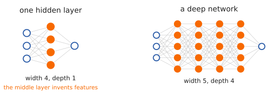
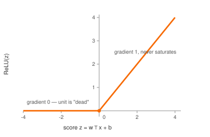
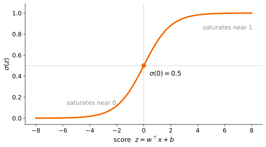

<!-- title: CIS400 — Neural Networks and LLM Intro -->

<!-- .slide: class="title-slide" -->

<span class="course-tag">CIS 400 • Syracuse University</span>

# Neural Networks and LLM Intro

## Kristopher Micinski

<div class="footer">cis400 &bull; cybersecurity &amp; ai</div>

---

## Last class: linear regression

* Given data <span class="ktx" data-tex="eyh4X2ksIHlfaSl9X3tpPTF9XntufQ=="></span> — at the simplest, a bunch of pairs:
  <span class="ktx" data-tex="eygxLDMpLCAoMyw1KSwgKDQsNiksIFxsZG90c30="></span>
* Want to *learn* an approximation to the distribution, <span class="ktx" data-tex="Zih4KSBcbWFwc3RvIFxoYXR7eX0="></span>

  * <span class="ktx" data-tex="eA=="></span> is an input we did not train on; <span class="ktx" data-tex="XGhhdHt5fQ=="></span> is the model's *prediction*,
    as distinct from the true label <span class="ktx" data-tex="eQ=="></span>
* To do this, we will *assume a shape* for the function <span class="ktx" data-tex="Zg=="></span>:

<span class="ktx" data-d="1" data-tex="Clx1bmRlcmJyYWNle3deXHRvcCB4ICsgYn1fe1x0ZXh0e2xpbmVhciBpbiBpbnB1dHN9fQpcO1xsb25ncmlnaHRhcnJvd1w7Clx1bmRlcmJyYWNle1xzaWdtYSh3Xlx0b3AgeCArIGIpfV97XHRleHR7bGluZWFyIGNvbWJpbmF0aW9ufSBcLFxtYXBzdG9cLCBcdGV4dHtzaWdtb2lkfX0KXDtcbG9uZ3JpZ2h0YXJyb3dcOwpcdW5kZXJicmFjZXtcc2lnbWEoV18yXCxcc2lnbWEoV18xIHggKyBiXzEpICsgYl8yKX1fe1x0ZXh0e25ldXJhbCBuZXR3b3JrfX0K"></span>

* By making a guess about the shape of <span class="ktx" data-tex="Zg=="></span>, we're imposing an assumption about the
  underlying distribution from which we're sampling
* From there, we build a function <span class="ktx" data-tex="Zl9cdGhldGE="></span> with a certain shape, determined by
  *parameters* <span class="ktx" data-tex="XHRoZXRh"></span>

---

## Features and Feature Vectors

* For simple datasets, we'll just have a single scalar as our observation
* But in general, we'll have a *collection* of features, which we will represent as a vector
* Why store as a vector? Why not, e.g., a dictionary:
  `{"zipcode": 13210, "sqft": 1050, "bathrooms": 2}`?
* Answer: many operations in the process naturally lend themselves to *matrix
  algebra*, which computers are *very good at* because it is obviously
  parallelizable.
* So we use a vector <span class="ktx" data-tex="eCBcaW4gXG1hdGhiYntSfV57M30="></span>, where the *index* carries the meaning:

<span class="ktx" data-d="1" data-tex="CnggXDs9XDsKXGJlZ2lue2JtYXRyaXh9IDEzMjEwIFxcIDEwNTAgXFwgMiBcZW5ke2JtYXRyaXh9ClxxdWFkClxiZWdpbnthcnJheX17bH0KXGxlZnRhcnJvd1w7IHhfMCA6IFx0ZXh0e3ppcGNvZGV9IFxcClxsZWZ0YXJyb3dcOyB4XzEgOiBcdGV4dHtzcWZ0fSBcXApcbGVmdGFycm93XDsgeF8yIDogXHRleHR7YmF0aHJvb21zfQpcZW5ke2FycmF5fQo="></span>

* Convention: the number of features is <span class="ktx" data-tex="ZA=="></span>, so a single observation is a vector <span class="ktx" data-tex="eCBcaW4gXG1hdGhiYntSfV57ZH0="></span>

---

## Matrix Algebra

* Linear regression: estimate a linear distribution with Gaussian noise
* In terms of matrix algebra, the input and the weights are both vectors in
  <span class="ktx" data-tex="XG1hdGhiYntSfV57ZH0="></span>:

<span class="ktx" data-d="1" data-tex="CnggXDs9XDsgXGJlZ2lue2JtYXRyaXh9IHhfMCBcXCB4XzEgXFwgXHZkb3RzIFxcIHhfe2QtMX0gXGVuZHtibWF0cml4fQpccXF1YWQKdyBcOz1cOyBcYmVnaW57Ym1hdHJpeH0gd18wIFxcIHdfMSBcXCBcdmRvdHMgXFwgd197ZC0xfSBcZW5ke2JtYXRyaXh9Cg=="></span>

* Our prediction is a *linear combination* of the weights with the features:

<span class="ktx" data-d="1" data-tex="ClxoYXR7eX0gXDs9XDsgd18wIHhfMCArIHdfMSB4XzEgKyBcY2RvdHMgKyB3X3tkLTF9IHhfe2QtMX0KXDs9XDsgXHN1bV97aT0wfV57ZC0xfSB3X2kgeF9pCg=="></span>

* This is *just the dot product* <span class="ktx" data-tex="Zl93KHgpID0gd15cdG9wIHg="></span>!

  * We've dropped the intercept <span class="ktx" data-tex="Yg=="></span> from the first slide to keep things clean;
    everything here carries through with <span class="ktx" data-tex="Zl97dyxifSh4KSA9IHdeXHRvcCB4ICsgYg=="></span>

---

## Now let's do a *batch* of predictions

* We often want to do estimation on a *batch* of observations

  * E.g., in training, we have millions of observations
* We can treat the batch as an <span class="ktx" data-tex="biBcdGltZXMgZA=="></span> matrix <span class="ktx" data-tex="WA=="></span> — one observation per *row*:

<span class="ktx" data-d="1" data-tex="ClggXDs9XDsKXGJlZ2lue2JtYXRyaXh9CnheeygxKX1fMCAmIHheeygxKX1fMSAmIFxjZG90cyAmIHheeygxKX1fe2QtMX0gXFwKeF57KDIpfV8wICYgeF57KDIpfV8xICYgXGNkb3RzICYgeF57KDIpfV97ZC0xfSBcXApcdmRvdHMgJiBcdmRvdHMgJiBcZGRvdHMgJiBcdmRvdHMgXFwKeF57KG4pfV8wICYgeF57KG4pfV8xICYgXGNkb3RzICYgeF57KG4pfV97ZC0xfQpcZW5ke2JtYXRyaXh9Clw7XGluXDsgXG1hdGhiYntSfV57biBcdGltZXMgZH0K"></span>

* Then *every* prediction in the batch is one matrix-vector product, whose
  <span class="ktx" data-tex="aQ=="></span>-th entry is exactly the dot product from before:

<span class="ktx" data-d="1" data-tex="ClxoYXR7eX0gXDs9XDsgWCB3IFw7XGluXDsgXG1hdGhiYntSfV57bn0sClxxcXVhZApcaGF0e3l9X2kgXDs9XDsgeF57KGkpXHRvcH0gdwo="></span>

* Trivially parallelizable on the GPU

---

## Learning the weights

* Our goal is to learn a weight vector <span class="ktx" data-tex="dw=="></span> so that our predictions <span class="ktx" data-tex="XGhhdHt5fQ=="></span> end
  up close to our training-set observations <span class="ktx" data-tex="eQ=="></span>
* For linear regression, a natural choice is squared error:

<span class="ktx" data-d="1" data-tex="CkwodykgXDs9XDsgXGZyYWN7MX17bn0gXHN1bV97aT0xfV57bn0gXGJpZ2woIFxoYXR7eX1faSAtIHlfaSBcYmlncileezJ9Cg=="></span>

* Implement as a loop: `for` each observation, calculate distance between guess and ground truth, and take the average.
* *Learning* is then just minimization over <span class="ktx" data-tex="dw=="></span>:

<span class="ktx" data-d="1" data-tex="Cndee1xzdGFyfSBcOz1cOyBcYXJnXG1pbl97dyBcaW4gXG1hdGhiYntSfV57ZH19IFw7IEwodykK"></span>

---

## From Linear Models to Neural Networks

* Linear model: <span class="ktx" data-tex="XGhhdHt5fSA9IHdeXHRvcCB4ICsgYg=="></span>
* Powerful, but limited to linear decision boundaries
* Neural networks: *compose* many such maps, putting a nonlinearity <span class="ktx" data-tex="XHNpZ21h"></span>
  between them:

<span class="ktx" data-d="1" data-tex="CmYoeCkgXDs9XDsgXHNpZ21hXGJpZ2woIFdfMiBcLCBcc2lnbWEoIFdfMSB4ICsgYl8xICkgKyBiXzIgXGJpZ3IpCg=="></span>

* Each <span class="ktx" data-tex="V19pIHggKyBiX2k="></span> is a *layer*; <span class="ktx" data-tex="XHNpZ21h"></span> is the *activation*

<div style="display:flex; align-items:flex-start; justify-content:center; gap:0.5rem;">
  <div style="width:42%;">
    <div style="font-size:0.5em; text-align:center; margin-bottom:0.25em;">a single neuron</div>
    
  </div>
  
</div>

---

## Why Activation Functions?

* Without activations, stacked layers remain linear

  * Any number of linear layers collapses to a *single* linear layer:

<span class="ktx" data-d="1" data-tex="CldfMiAoIFdfMSB4ICsgYl8xICkgKyBiXzIKXDs9XDsKXHVuZGVyYnJhY2V7KFdfMiBXXzEpfV97Vyd9IHggXDsrXDsgXHVuZGVyYnJhY2V7KFdfMiBiXzEgKyBiXzIpfV97Yid9Cg=="></span>

* Activations introduce nonlinearity, so depth actually buys you something
* Allows the network to approximate complex, nonlinear functions
* Common choices:

<span class="ktx" data-d="1" data-tex="ClxtYXRocm17UmVMVX0oeCkgPSBcbWF4KDAsIHgpClxxcXVhZApcc2lnbWEoeCkgPSBcZnJhY3sxfXsxICsgZV57LXh9fQpccXF1YWQKXHRhbmgoeCkgPSBcZnJhY3tlXnt4fSAtIGVeey14fX17ZV57eH0gKyBlXnsteH19Cg=="></span>

---

## ReLU: Rectified Linear Unit

* <span class="ktx" data-tex="XG1hdGhybXtSZUxVfSh4KSA9IFxtYXgoMCwgeCk="></span> — most common "hidden layer" activation
* Cheap: one comparison, no exponentials
* Its derivative is trivial, and does not *saturate* for <span class="ktx" data-tex="eCA+IDA="></span>:

<span class="ktx" data-d="1" data-tex="ClxmcmFje2R9e2R4fVxtYXRocm17UmVMVX0oeCkgXDs9XDsKXGJlZ2lue2Nhc2VzfQoxICYgeCA+IDAgXFwKMCAmIHggPCAwClxlbmR7Y2FzZXN9Cg=="></span>

* Sigmoid and <span class="ktx" data-tex="XHRhbmg="></span> flatten out for large <span class="ktx" data-tex="fHh8"></span>, so their gradients vanish and
  learning stalls; ReLU's does not
* Undefined at <span class="ktx" data-tex="eCA9IDA="></span>; in practice implementations just take <span class="ktx" data-tex="MA=="></span>

<div style="display:flex; align-items:flex-end; justify-content:center; gap:2rem;">
  <div style="width:30%;">
    
  </div>
  <div style="width:25%;">
    
    <div style="font-size:0.45em; text-align:center; color:#555;">for contrast: sigmoid flattens at both ends</div>
  </div>
</div>

---

## Designing a neural network

* Many design choices
* Number of features (<span class="ktx" data-tex="ZA=="></span>) — fixed by the data and your feature engineering
* Number of neurons per layer: network's *width*
* Number of hidden layers: network's *depth*
* Choose activation function (<span class="ktx" data-tex="XG1hdGhybXtSZUxVfQ=="></span> for hidden layers, almost always)
* Output layer: determined by the task

  * Regression: 1 unit, no activation
  * Binary classification: 1 unit + sigmoid, read as <span class="ktx" data-tex="XFByW3kgPSAxIFxtaWQgeF0="></span>
  * <span class="ktx" data-tex="aw=="></span>-way classification: <span class="ktx" data-tex="aw=="></span> units + softmax
* *We* design the *architecture*, training learns the parameters

---

## Backpropagation: learning the parameters

* A neural network may have *millions or billions* of weights and biases
* Training means changing each parameter slightly so that the loss <span class="ktx" data-tex="TA=="></span> decreases
* So we need to know: **how did each parameter contribute to the error?**
* The key idea: the network is a *composition of functions*:

<span class="ktx" data-d="1" data-tex="CngKXDtcbG9uZ3JpZ2h0YXJyb3dcOwp6XzEKXDtcbG9uZ3JpZ2h0YXJyb3dcOwphXzEKXDtcbG9uZ3JpZ2h0YXJyb3dcOwp6XzIKXDtcbG9uZ3JpZ2h0YXJyb3dcOwpcaGF0IHkKXDtcbG9uZ3JpZ2h0YXJyb3dcOwpMCg=="></span>

* The **forward pass** computes the prediction and loss from left to right
* **Backpropagation** works backward from the loss, using the *chain rule* to
  determine how much each parameter contributed to it:

<span class="ktx" data-d="1" data-tex="CkwKXDtcbG9uZ3JpZ2h0YXJyb3dcOwpXXzIsYl8yClw7XGxvbmdyaWdodGFycm93XDsKV18xLGJfMQo="></span>

* This gives us the gradient <span class="ktx" data-tex="XG5hYmxhX1x0aGV0YSBM"></span>: one derivative for every
  learnable parameter in the network
* Then gradient descent updates *all* of them:

<span class="ktx" data-d="1" data-tex="Clxib3hlZHtcdGhldGEgXGxlZnRhcnJvdyBcdGhldGEgLSBcZXRhIFxuYWJsYV9cdGhldGEgTH0K"></span>

---

## From neural networks to language

* So far: inputs are fixed-size vectors <span class="ktx" data-tex="eCBcaW4gXG1hdGhiYntSfV5k"></span>
* But language is not naturally a fixed-size vector
* A sentence is a *sequence*:

<span class="ktx" data-d="1" data-tex="Clx0ZXh0e2BgdGhlIG1vZGVsIHByZWRpY3RzIHRva2VucycnfQpccXVhZFxsZWFkc3RvXHF1YWQKKHRfMSwgdF8yLCB0XzMsIHRfNCkK"></span>

* To use neural networks on language, we need two steps:

  * turn text into discrete symbols: **tokens**
  * turn tokens into vectors: **embeddings**

---

## Tokenization

* LLMs do not directly read characters or words
* They read **tokens**
* A token might be:

  * a whole word: `cat`
  * part of a word: `predict`, `ion`
  * punctuation: `.`
  * whitespace or formatting

<span class="ktx" data-d="1" data-tex="Clx0ZXh0e2BgbmV1cmFsIG5ldHdvcmtzIGFyZSBjb29sJyd9Clw7XGxvbmdyaWdodGFycm93XDsKW3RfMSwgdF8yLCB0XzMsIHRfNF0K"></span>

* The model sees token IDs, not English words:

<span class="ktx" data-d="1" data-tex="Clt0XzEsdF8yLHRfMyx0XzRdID0gWzE4NDMyLCA5MjMxLCA1MjcsIDczMjFdCg=="></span>

---

## From tokens to vectors

* Token IDs are just integers
* But neural networks need vectors
* So each token ID is mapped to an **embedding vector**

<span class="ktx" data-d="1" data-tex="ClxtYXRocm17ZW1iZWR9KHRfaSkgPSB4X2kgXGluIFxtYXRoYmJ7Un1eZAo="></span>

* The embedding table is a learned matrix:

<span class="ktx" data-d="1" data-tex="CkUgXGluIFxtYXRoYmJ7Un1ee3xcbWF0aGNhbHtWfXwgXHRpbWVzIGR9Cg=="></span>

* <span class="ktx" data-tex="fFxtYXRoY2Fse1Z9fA=="></span> is the vocabulary size
* <span class="ktx" data-tex="ZA=="></span> is the embedding dimension
* The row <span class="ktx" data-tex="RVt0X2ld"></span> is the vector for token <span class="ktx" data-tex="dF9p"></span>

---

## Language modeling

* The basic training task is simple:

> Given the previous tokens, predict the next token.

<span class="ktx" data-d="1" data-tex="ClxQclt0X3tpKzF9IFxtaWQgdF8xLCB0XzIsIFxsZG90cywgdF9pXQo="></span>

* Example:

<span class="ktx" data-d="1" data-tex="Clx0ZXh0e2BgVGhlIHBhc3N3b3JkIHNob3VsZCBiZScnfQpcO1xsb25ncmlnaHRhcnJvd1w7Cj8K"></span>

* The model outputs a probability distribution over the whole vocabulary:

<span class="ktx" data-d="1" data-tex="CnAgXGluIFxtYXRoYmJ7Un1ee3xcbWF0aGNhbHtWfXx9Cg=="></span>

* Training uses the actual next token as the label

---

## Next-token prediction as classification

* For every position, the model performs a huge classification problem
* Input: previous context
* Output: probability of each possible next token

<span class="ktx" data-d="1" data-tex="ClxoYXR7eX0KPQpcbWF0aHJte3NvZnRtYXh9KHopCg=="></span>

<span class="ktx" data-d="1" data-tex="ClxoYXR7eX1fago9ClxQcltcdGV4dHtuZXh0IHRva2VuIGlzIH0gal0K"></span>

* Loss is cross-entropy:

<span class="ktx" data-d="1" data-tex="CkwKPQotXGxvZyBcUHJbXHRleHR7Y29ycmVjdCBuZXh0IHRva2VufV0K"></span>

* Same idea as ordinary classification, but with a massive number of classes

---

## Why context matters

* Words depend on earlier words
* The same token can mean different things in different contexts:

<span class="ktx" data-d="1" data-tex="Clx0ZXh0e2BgYmFuayBhY2NvdW50Jyd9ClxxcXVhZApcdGV4dHtgYHJpdmVyIGJhbmsnJ30K"></span>

* So we do not want a fixed meaning for each token
* We want a **contextual representation**

<span class="ktx" data-d="1" data-tex="CnhfaQpccXVhZFxsZWFkc3RvXHF1YWQKaF9pCg=="></span>

* <span class="ktx" data-tex="eF9p"></span> is the initial embedding
* <span class="ktx" data-tex="aF9p"></span> is the token's meaning *after looking at the surrounding context*

---

## Attention

* Attention lets each token look at other tokens
* For each token, the model asks:

> Which previous tokens are relevant to understanding this token?

* Attention computes a weighted average of other token representations:

<span class="ktx" data-d="1" data-tex="CmhfaQo9ClxzdW1faiBcYWxwaGFfe2lqfSB2X2oK"></span>

* <span class="ktx" data-tex="XGFscGhhX3tpan0="></span> says how much token <span class="ktx" data-tex="aQ=="></span> attends to token <span class="ktx" data-tex="ag=="></span>
* Large weight: token <span class="ktx" data-tex="ag=="></span> matters a lot
* Small weight: token <span class="ktx" data-tex="ag=="></span> matters little

---

## Transformers

* Modern LLMs are built from **transformer blocks**
* Each block repeatedly applies:

  * attention: mix information across tokens
  * feedforward layers: process each token representation
  * normalization and residual connections: stabilize training

<span class="ktx" data-d="1" data-tex="Clx0ZXh0e3Rva2Vuc30KXDtcbG9uZ3JpZ2h0YXJyb3dcOwpcdGV4dHtlbWJlZGRpbmdzfQpcO1xsb25ncmlnaHRhcnJvd1w7Clx0ZXh0e3RyYW5zZm9ybWVyIGJsb2Nrc30KXDtcbG9uZ3JpZ2h0YXJyb3dcOwpcdGV4dHtuZXh0LXRva2VuIHByb2JhYmlsaXRpZXN9Cg=="></span>

* Stacking many transformer blocks gives the model depth
* Increasing embedding size and hidden dimensions gives the model width

---

## What makes it “large”?

* LLMs are ordinary neural networks, but scaled up:

  * many layers
  * huge hidden dimensions
  * very large training datasets
  * billions or trillions of parameters

* Parameters are still just weights and biases

* Training still uses gradient descent and backpropagation

* The surprising part is what emerges from scale:

<span class="ktx" data-d="1" data-tex="Clx0ZXh0e25leHQtdG9rZW4gcHJlZGljdGlvbn0KXDtcbGVhZHN0b1w7Clx0ZXh0e3RyYW5zbGF0aW9uLCBjb2RpbmcsIHJlYXNvbmluZywgc3VtbWFyaXphdGlvbiwgZGlhbG9ndWV9Cg=="></span>

---

## LLMs and cybersecurity

* LLMs matter for cybersecurity because they operate on symbolic artifacts:

  * source code
  * shell commands
  * logs
  * alerts
  * configuration files
  * binaries and reverse-engineering notes

* But the same flexibility creates risks:

  * prompt injection
  * insecure code generation
  * hallucinated explanations
  * automated phishing
  * over-trusting model outputs

* Core question for this course:

> How do we use AI systems without blindly trusting them?

---

## From LLMs to reasoning models

* A normal language model repeatedly predicts the next token:

<span class="ktx" data-d="1" data-tex="CnRfMSwgXGxkb3RzLCB0X2kKXDtcbG9uZ3JpZ2h0YXJyb3dcOwpcUHJbdF97aSsxfSBcbWlkIHRfMSxcbGRvdHMsdF9pXQo="></span>

* But difficult problems may require many intermediate steps

  * solve an equation
  * debug a program
  * plan a sequence of actions
  * reason through competing hypotheses
* Modern **reasoning models** explicitly spend additional computation on these
  intermediate steps before producing the answer

<span class="ktx" data-d="1" data-tex="Clx0ZXh0e3Byb21wdH0KXDtcbG9uZ3JpZ2h0YXJyb3dcOwpcdGV4dHtyZWFzb25pbmd9Clw7XGxvbmdyaWdodGFycm93XDsKXHRleHR7YW5zd2VyfQo="></span>

---

## Reasoning means more computation at inference time

* Recall: **training time** is when we learn the model's parameters
* **Inference time** is when we actually run the trained model
* Ordinary generation spends roughly one forward computation per generated token
* Reasoning models can generate many additional tokens of intermediate computation
  before producing the user-visible response

<span class="ktx" data-d="1" data-tex="Clx0ZXh0e2Vhc3kgcXVlc3Rpb259Clw7XGxvbmdyaWdodGFycm93XDsKXHRleHR7bGl0dGxlIGNvbXB1dGF0aW9ufQo="></span>

<span class="ktx" data-d="1" data-tex="Clx0ZXh0e2hhcmQgcXVlc3Rpb259Clw7XGxvbmdyaWdodGFycm93XDsKcl8xLHJfMixcbGRvdHMscl9tClw7XGxvbmdyaWdodGFycm93XDsKXHRleHR7YW5zd2VyfQo="></span>

* This is often called **test-time compute**
* More difficult problems can therefore receive more computation

---

## What is a reasoning trace?

* Suppose the user asks:

> What is the largest prime divisor of 8,139,881?

* A reasoning model might internally generate something like:

<span class="ktx" data-d="1" data-tex="CnJfMSBccmlnaHRhcnJvdyByXzIgXHJpZ2h0YXJyb3cgcl8zIFxyaWdodGFycm93IFxjZG90cyBccmlnaHRhcnJvdyByX20K"></span>

* These intermediate tokens are the model's **reasoning trace** or
  **chain of thought** (Wei et al., 2022)
* They may contain attempted approaches, intermediate calculations, hypotheses that are later rejected, results returned from tools
* Then the model generates a much shorter answer for the user

<span class="ktx" data-d="1" data-tex="Clx1bmRlcmJyYWNle3JfMSxcbGRvdHMscl9tfV97XHRleHR7cmVhc29uaW5nIHRyYWNlfX0KXHF1YWRcbG9uZ3JpZ2h0YXJyb3dccXVhZApcdW5kZXJicmFjZXt5fV97XHRleHR7dXNlci12aXNpYmxlIGFuc3dlcn19Cg=="></span>

---

## Scratchpads: tokens as working memory

* An important precursor to modern reasoning models was the **scratchpad**
* Basic idea: instead of forcing the model to produce the answer immediately,
  let it generate intermediate computation

<span class="ktx" data-d="1" data-tex="Clx1bmRlcmJyYWNle3h9X3tcdGV4dHtwcm9ibGVtfX0KXDtcbG9uZ3JpZ2h0YXJyb3dcOwpcdW5kZXJicmFjZXtyXzEscl8yLFxsZG90cyxyX219X3tcdGV4dHtzY3JhdGNocGFkfX0KXDtcbG9uZ3JpZ2h0YXJyb3dcOwpcdW5kZXJicmFjZXt5fV97XHRleHR7YW5zd2VyfX0K"></span>

* The scratchpad is not a special neural-network component
* It is just **more generated text**
* Because generation is autoregressive, each intermediate result becomes part of
  the context for computing the next one

<div style="font-size:0.38em; color:#666; margin-top:0.7em;">
Nye et al., “Show Your Work: Scratchpads for Intermediate Computation with Language Models,” 2021.
</div>

---

## Why can a scratchpad help?

* Without a scratchpad, the model must effectively jump directly from problem to answer:

<span class="ktx" data-d="1" data-tex="CnggXGxvbmdyaWdodGFycm93IHkK"></span>

* With a scratchpad, it can decompose the computation:

<span class="ktx" data-d="1" data-tex="CngKXGxvbmdyaWdodGFycm93IHJfMQpcbG9uZ3JpZ2h0YXJyb3cgcl8yClxsb25ncmlnaHRhcnJvdyBcY2RvdHMKXGxvbmdyaWdodGFycm93IHJfbQpcbG9uZ3JpZ2h0YXJyb3cgeQo="></span>

* Each <span class="ktx" data-tex="cl9p"></span> is an ordinary token sequence
* Once generated, it can be attended to just like the original prompt
* This gives the model an **external working memory**

  * save intermediate results
  * break a problem into smaller steps
  * reuse earlier calculations

> More tokens can mean more sequential computation.

---

## Chain-of-thought prompting

* Wei et al. showed that sufficiently large language models could be prompted to
  generate useful intermediate reasoning without changing the architecture
* Instead of demonstrating only:

<span class="ktx" data-d="1" data-tex="Clx0ZXh0e3F1ZXN0aW9ufSBcbG9uZ3JpZ2h0YXJyb3cgXHRleHR7YW5zd2VyfQo="></span>

* Provide examples containing a **chain of thought**:

<span class="ktx" data-d="1" data-tex="Clx0ZXh0e3F1ZXN0aW9ufQpcbG9uZ3JpZ2h0YXJyb3cKXHRleHR7cmVhc29uaW5nIHN0ZXBzfQpcbG9uZ3JpZ2h0YXJyb3cKXHRleHR7YW5zd2VyfQo="></span>

* The model then imitates this structure on new problems
* This substantially improved performance on arithmetic, commonsense, and
  symbolic reasoning tasks

<div style="font-size:0.38em; color:#666; margin-top:0.7em;">
Wei et al., “Chain-of-Thought Prompting Elicits Reasoning in Large Language Models,” NeurIPS 2022.
</div>

---

## At the model level: reasoning is still next-token prediction

* Inside the transformer, nothing fundamentally different has happened:

<span class="ktx" data-d="1" data-tex="ClxQclt0X3tpKzF9IFxtaWQgdF8xLFxsZG90cyx0X2ldCg=="></span>

* We arrange for some generated tokens to represent **intermediate computation**
* Those tokens become context for subsequent predictions:

<span class="ktx" data-d="1" data-tex="Clx0ZXh0e3Byb2JsZW19ClxyaWdodGFycm93Clxib3hlZHtcdGV4dHtyZWFzb25pbmcgdG9rZW5zfX0KXHJpZ2h0YXJyb3cKXGJveGVke1x0ZXh0e2Fuc3dlciB0b2tlbnN9fQo="></span>

* So the model can use its own output as a computational workspace
* But a deployed LLM is **not just the transformer**

> There is a serving system around the model that decides what the client sees.

---

## Even the prompt can elicit reasoning

* Chain-of-thought prompting originally used *examples* containing reasoning
* Kojima et al. found that large models could often be induced to reason
  **zero-shot**
* Their famous prompt was simply:

> “Let’s think step by step.”

* No worked examples were required
* On several reasoning benchmarks, asking for intermediate steps dramatically
  improved performance

<span class="ktx" data-d="1" data-tex="Clx0ZXh0e3Byb21wdH0KXDsrXDsKXHRleHR7YGB0aGluayBzdGVwIGJ5IHN0ZXAnJ30KXGxvbmdyaWdodGFycm93CnJfMSxcbGRvdHMscl9tClxsb25ncmlnaHRhcnJvdwp5Cg=="></span>

<div style="font-size:0.38em; color:#666; margin-top:0.7em;">
Kojima et al., “Large Language Models are Zero-Shot Reasoners,” NeurIPS 2022.
</div>

---

## We can spend even more computation

* A single reasoning trace might make a mistake
* So why generate only one?

<span class="ktx" data-d="1" data-tex="CnJeeygxKX0gXGxvbmdyaWdodGFycm93IHleeygxKX0K"></span>

<span class="ktx" data-d="1" data-tex="CnJeeygyKX0gXGxvbmdyaWdodGFycm93IHleeygyKX0K"></span>

<span class="ktx" data-d="1" data-tex="Clx2ZG90cwo="></span>

<span class="ktx" data-d="1" data-tex="CnJeeyhrKX0gXGxvbmdyaWdodGFycm93IHleeyhrKX0K"></span>

* **Self-consistency:** sample multiple reasoning paths and choose the answer
  supported by the most paths
* This spends more inference-time computation to improve reliability
* This is an early version of an idea that becomes central to modern reasoning models:

> Spend more computation on harder problems.

<div style="font-size:0.38em; color:#666; margin-top:0.7em;">
Wang et al., “Self-Consistency Improves Chain of Thought Reasoning in Language Models,” ICLR 2023.
</div>

---

## Reasoning traces can also become training data

* So far, reasoning was generated **at inference time**
* But we can also train models on successful reasoning traces
* **STaR** (*Self-Taught Reasoner*) bootstraps this process:

<span class="ktx" data-d="1" data-tex="Clx0ZXh0e2dlbmVyYXRlIHJlYXNvbmluZ30KXHJpZ2h0YXJyb3cKXHRleHR7a2VlcCBzdWNjZXNzZnVsIHRyYWNlc30KXHJpZ2h0YXJyb3cKXHRleHR7dHJhaW4gb24gdGhlbX0KXHJpZ2h0YXJyb3cKXHRleHR7cmVwZWF0fQo="></span>

* The model gradually learns to generate reasoning patterns that are useful for
  solving problems
* Reasoning can therefore appear both:

  * in the model's **training data**
  * as additional **test-time computation**

<div style="font-size:0.38em; color:#666; margin-top:0.7em;">
Zelikman et al., “STaR: Self-Taught Reasoner Bootstrapping Reasoning With Reasoning,” NeurIPS 2022.
</div>

---

## From visible scratchpads to hidden reasoning

* Scratchpads and classical chain-of-thought prompting put intermediate reasoning
  directly into the generated text
* That made the computation visible:

<span class="ktx" data-d="1" data-tex="Clx0ZXh0e3Byb21wdH0KXHJpZ2h0YXJyb3cKXGJveGVke1x0ZXh0e3Zpc2libGUgcmVhc29uaW5nfX0KXHJpZ2h0YXJyb3cKXHRleHR7YW5zd2VyfQo="></span>

* Modern reasoning systems may instead separate the reasoning trace from the
  response shown to the user:

<span class="ktx" data-d="1" data-tex="Clx0ZXh0e3Byb21wdH0KXHJpZ2h0YXJyb3cKXGJveGVke1x0ZXh0e2hpZGRlbiByZWFzb25pbmd9fQpccmlnaHRhcnJvdwpcdGV4dHt2aXNpYmxlIGFuc3dlcn0K"></span>

* The basic idea is similar: use additional generated computation before answering
* But hiding that computation creates an entirely new **security boundary**

---

## A deployed LLM is more than the model

* When we use ChatGPT, Claude, Gemini, etc., we normally do **not**
  interact directly with a transformer
* We interact with an **inference service / API**

<span class="ktx" data-d="1" data-tex="Clx0ZXh0e3VzZXJ9Clxsb25ncmlnaHRhcnJvdwpcYm94ZWR7XHRleHR7QVBJIC8gc2VydmluZyBsYXllcn19Clxsb25ncmlnaHRhcnJvdwpcYm94ZWR7XHRleHR7TExNfX0K"></span>

* The serving layer handles things such as:

  * constructing the model's input
  * system prompts and conversation history
  * tool calls
  * token generation and stopping conditions
  * reasoning vs. user-visible output
  * packaging the result into an API response

* So there are two different objects to keep straight:

<span class="ktx" data-d="1" data-tex="Clxib3hlZHtcdGV4dHttb2RlbCB0b2tlbiBzdHJlYW19fQpccXF1YWRcbmVxXHFxdWFkClxib3hlZHtcdGV4dHtBUEkgcmVzcG9uc2V9fQo="></span>

---

## How does it know reasoning from the answer?

* Conceptually, generation has different **regions**:

<span class="ktx" data-d="1" data-tex="Clx0ZXh0e3JlYXNvbmluZyB0b2tlbnN9ClxxdWFkXGxvbmdyaWdodGFycm93XHF1YWQKXHRleHR7ZmluYWwtYW5zd2VyIHRva2Vuc30K"></span>

* The model and serving system must agree on where those regions begin and end
* This may involve special control tokens or other internal protocol state

```text
<reasoning>
    ...
</reasoning>
<final>
    ...
</final>
```

* These need **not** be literal plaintext strings
* They may be reserved tokens or internal markers interpreted by the serving stack
* Exact mechanisms are provider-specific and generally not publicly documented

> The API can expose the final answer without exposing the reasoning.

---

## The serving layer produces a structured response

* The API can turn different regions of model computation into different
  **structured blocks**

Conceptually:

```json
{
  "content": [
    {
      "type": "thinking",
      "summary": "...",
      "signature": "OPAQUE-ENCRYPTED-DATA..."
    },
    {
      "type": "text",
      "text": "The largest prime divisor is 5003."
    }
  ]
}
```

* `text` is returned as user-visible output
* The complete reasoning need not be returned as readable text
* Instead, the API may return an **opaque reasoning object**
* Different providers use different formats and field names

<span class="ktx" data-d="1" data-tex="Clxib3hlZHtcdGV4dHttb2RlbCBjb21wdXRhdGlvbn19Clxsb25ncmlnaHRhcnJvdwpcYm94ZWR7XHRleHR7c2VydmluZyBsYXllcn19Clxsb25ncmlnaHRhcnJvdwpcYmVnaW57Y2FzZXN9Clx0ZXh0e3Zpc2libGUgYW5zd2VyfVxcClx0ZXh0e29wYXF1ZSByZWFzb25pbmcgc3RhdGV9ClxlbmR7Y2FzZXN9Cg=="></span>

<div style="font-size:0.38em; color:#666; margin-top:0.7em;">
Panfilov et al., “Stealing Reasoning Traces from Proprietary LLM APIs,” 2026.
</div>

---

## Why hide the reasoning?

* Complete reasoning traces may reveal valuable or sensitive information:

  * how a proprietary model solves difficult problems
  * intermediate user data
  * tool outputs
  * contextual secrets
  * safety and refusal behavior
* Model providers therefore have reasons **not** to return the trace in plaintext

<span class="ktx" data-d="1" data-tex="Clx0ZXh0e3JlYXNvbmluZyB0cmFjZX0KXDtcbm90XGxvbmdyaWdodGFycm93XDsKXHRleHR7dXNlcn0K"></span>

* But multi-turn conversations still need some way to preserve that state
* And that brings us to a systems problem: **where does the hidden state live?**

---

## Why give encrypted reasoning to the client?

* One option is for the provider to store all hidden reasoning server-side:

<span class="ktx" data-d="1" data-tex="Clx0ZXh0e2NvbnZlcnNhdGlvbiBJRH0KXGxvbmdyaWdodGFycm93Clx0ZXh0e3NlcnZlci1zaWRlIHJlYXNvbmluZyBzdGF0ZX0K"></span>

* Instead, some APIs use a more **stateless** design for this reasoning state:

  * encrypt and authenticate the reasoning
  * return the opaque block to the client
  * require the client to send it back on the next request

<span class="ktx" data-d="1" data-tex="Clxib3hlZHtcdGV4dHtBUEl9fQpcbG9uZ3JpZ2h0YXJyb3cKXGJveGVke1x0ZXh0e2NsaWVudCBzdG9yZXMgZW5jcnlwdGVkIHJlYXNvbmluZ319Clxsb25ncmlnaHRhcnJvdwpcYm94ZWR7XHRleHR7QVBJfX0K"></span>

* The client cannot normally read or modify the reasoning
* But the provider can recover it when the block comes back
* This avoids requiring the provider to retain that reasoning state server-side

> The client becomes storage for server-created hidden state.

<div style="font-size:0.38em; color:#666; margin-top:0.7em;">
Panfilov et al., “Stealing Reasoning Traces from Proprietary LLM APIs,” 2026.
</div>

---

## Case study: “Stolen Thoughts”

* Modern reasoning models may produce hidden intermediate reasoning
* Providers often do **not** show this reasoning directly
* Instead, APIs may return an opaque encrypted block
* The client sends that block back later to preserve conversation state
* Key question:

> Is hidden reasoning actually private?

---

## The architectural tradeoff

* Server-side storage:

<span class="ktx" data-d="1" data-tex="Clx0ZXh0e3NlcnZlciBzdG9yZXMgcmVhc29uaW5nIHN0YXRlfQo="></span>

* Client-side encrypted storage:

<span class="ktx" data-d="1" data-tex="Clx0ZXh0e3NlcnZlciByZXR1cm5zIGVuY3J5cHRlZCByZWFzb25pbmcgYmxvY2t9Cg=="></span>

* Client-side storage lets the provider keep this reasoning-state protocol stateless
* But now the encrypted block becomes a portable artifact
* If it can be replayed in the wrong context, it becomes dangerous

---

## The core vulnerability

* The paper argues that encrypted reasoning blocks were too portable:

  * across sessions
  * across users
  * across models in the same provider ecosystem

* The encryption protected the *contents*

* But it did not sufficiently bind the block to:

<span class="ktx" data-d="1" data-tex="Clx0ZXh0e3VzZXJ9IFxxdWFkK1xxdWFkIFx0ZXh0e3Nlc3Npb259IFxxdWFkK1xxdWFkIFx0ZXh0e21vZGVsfSBccXVhZCtccXVhZCBcdGV4dHtjb252ZXJzYXRpb24gcG9zaXRpb259Cg=="></span>

---

## A weaker model as a decoder

* The attack pattern is conceptually simple:

  * strong model produces hidden reasoning
  * API returns an encrypted reasoning block
  * attacker replays that block to a weaker compatible model
  * weaker model is induced to reveal the hidden reasoning

* The stronger model is never directly jailbroken

* The weak link is compatibility across the model family

---

## Why this matters

* The paper identifies four main risks:

  * (1) stealing proprietary reasoning for distillation
  * (2) extracting secrets from shared logs
  * (3) surfacing harmful information hidden from the final answer
  * (4) invisible prompt injection through opaque reasoning blocks

* Not just a model problem, this is a security hole!

---

## Secret leakage from “safe-looking” logs

* Developers may publish API transcripts for reproducibility
* The visible text may look sanitized
* But encrypted reasoning blocks may still contain hidden sensitive data
* The paper scraped public traces and decoded many reasoning blocks
* It found leaked PII, credentials, API keys, passwords, and tokens

> You cannot sanitize what you cannot inspect.

---

## Prompt injection, but invisible

* Ordinary prompt injection appears in visible text
* Monitors can scan the prompt or transcript
* But an injected reasoning block is opaque to the user
* The model may treat it as its own prior reasoning
* This creates a hidden channel for malicious instructions

<span class="ktx" data-d="1" data-tex="Clx0ZXh0e2ludmlzaWJsZSBzdGF0ZX0gXDtcbG9uZ3JpZ2h0YXJyb3dcOyBcdGV4dHt2aXNpYmxlIG1vZGVsIGJlaGF2aW9yfQo="></span>

---

## Mitigation: bind the context

* A **MAC** (*Message Authentication Code*) is a cryptographic tag:

<span class="ktx" data-d="1" data-tex="CnQgPSBcbWF0aHJte01BQ31fayhtKQo="></span>

* <span class="ktx" data-tex="aw=="></span> is a secret key held by the model provider
* The client does **not** know <span class="ktx" data-tex="aw=="></span>
* Given the same message <span class="ktx" data-tex="bQ=="></span>, the server can recompute the MAC and check
  whether the message is authentic and unchanged

---

* Suppose <span class="ktx" data-tex="Qg=="></span> is the encrypted reasoning blob
* Authenticating only the blob:

<span class="ktx" data-d="1" data-tex="CnQgPSBcbWF0aHJte01BQ31fayhCKQo="></span>

proves that <span class="ktx" data-tex="Qg=="></span> is genuine — but does **not** say where it is allowed to be used

* Instead, authenticate the blob **together with its context**:

<span class="ktx" data-d="1" data-tex="CnQgPQpcbWF0aHJte01BQ31faygKQiBcLFx8XCwgXHRleHR7dXNlcklEfSBcLFx8XCwgXHRleHR7c2Vzc2lvbklEfQpcLFx8XCwgXHRleHR7bW9kZWxJRH0gXCxcfFwsIFx0ZXh0e2hpc3Rvcnl9CikK"></span>

* Here <span class="ktx" data-tex="fA=="></span> means “concatenate”
* Replaying the same blob under another user, session, model, or conversation
  changes the authenticated message, so verification fails

---

## Mitigation: defense in depth

* Possible defenses:

  * keep reasoning server-side
  * rotate keys for legacy traces
  * reject cross-user and cross-model replay
  * detect suspicious replay patterns
  * train models to refuse reasoning-transcription requests

* Cryptography helps

* But model behavior still matters

* The system is only as secure as its weakest compatible model

---
