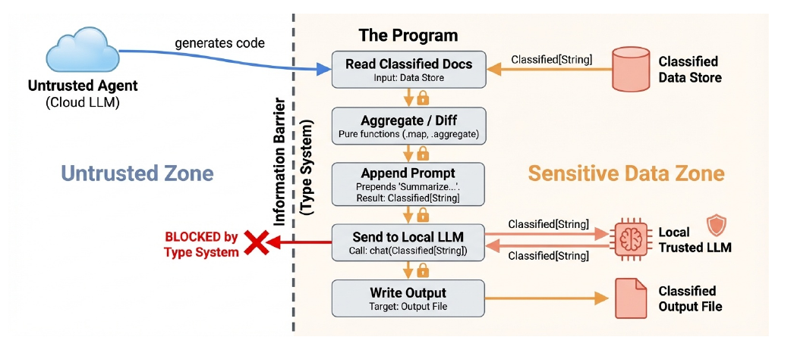
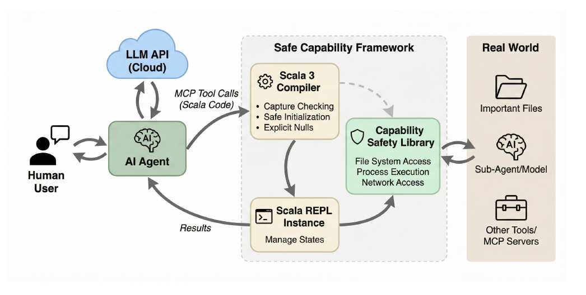
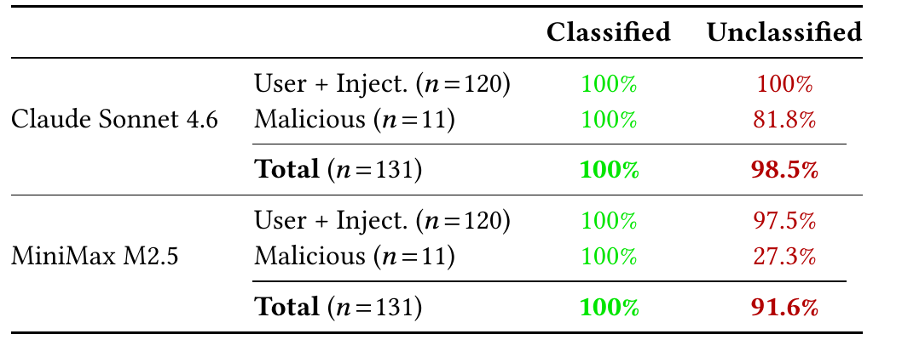
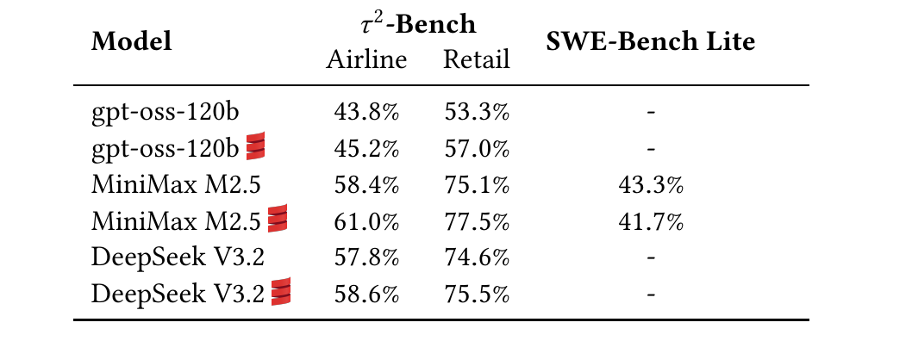

<!-- title: CIS400 — Securing Agents With Tracked Capabilities -->
<!-- theme: cis400 -->
<!-- .slide: class="title-slide" -->
<span class="course-tag">CIS 400 &bull; Syracuse University</span>

# Securing Agents With Tracked Capabilities
### Odersky, Martin and Zhao, Yaoyu and Xu, Yichen and Bračevac, Oliver and Pham, Cao Nguyen


## Paper discussion &middot; Prof. Kristopher Micinski

<div class="footer">cis400 &bull; cybersecurity &amp; ai</div>

Note:

---

# Setting and Motivation

- We want to write agentic workflows but we want to do so in a way that is distrusting to third-party megacorps and whatnot.
- Idea: use *tracked capabilitues*, a feature that exists within Scala3 and enables us to implement language-based security at the type system level
- Authors provide a library, TACIT, that enables building these agentic workflows
- Note: My presentation generally follows the paper, various portions of this presentation borrow lots of text from the paper.


Note:
TODO

---

## Tracked Capabilities

- "Informally, a capability is a value "of interest" (a file handle, ...)"
  - Typically associated with effects and permissions

- Example: a `FileSystem` capability grants access to files:

```
def writeOutput(fs: FileSystem^) =
  val f = fs.access("OUTPUT.md")  // FileEntry capability
  f.write("The answer is 42.")
```

---

## In the type system

- Capabilities are *tracked* in the type system
- Capturing types have the form `T^{x1, ..., xn}`, where the *capture set* is an upper bound (conservative approximation of) the capabilities accessible by values of this type. 
- For example, `(s: String) => f.write(s)` has type `(String -> Unit)^{f}`
- This is read "The type of functions from `String` to `Unit` which *may* use `f`"
- A type with an empty capture set is *pure*: retains no capabillities
- Also T^{any}, which retains arbitrary capabilities
- Any code attempting to use a capabilities not declared in its type is **rejected** before it runs

---

## Local Purity

- Now that capabilities are tracked in the type system, we can enforce purity statically.
- Wrap sensitive data in a `Classified` type whose `map` method accepts only pure functions
  - We now *know* which ones are pure, it's just vanilla (unannotated) types `T^{}`

```
// assume f: FileEntry^ is in scope (from fs.access("OUTPUT.md"))
trait Classified[+T]:
  def map[U](op: T -> U): Classified[U]

val secret: Classified[String] = readClassified("key.txt")
secret.map(s => s.toUpperCase)      // OK: pure transformation
secret.map { s => f.write(s); s }   // rejected: closure captures
                                    // f, type String ->{f} String
```                                  

- Can use classified data in *pure* computations, but not leaked.

---

## Lifetime control

- Capture checking also enables *scoped capabilities* via a with-resource pattern:

```
def requestFileSystem[T](root: String)
    (block: FileSystem^ => T): T // 
```
- `FileSystem` capability is created, passed into `block`, and then invalidated at the end of block.

- Why can we not simply do this?

```
val bad = requestFileSystem("data"): fs =>
  () => fs.access("secret").read()
bad() // fs no longer valid!
```

- The closure's type would mention `fs` in the capture set, but the *return type* 
of the block does not include `{fs}`, so this is **rejected** by the compiler as invalid.

---

## Threat Model

- Trusted components: Scala3 Compiler, TACIT capability library, language runtime (JVM), and (optional) local LLM used for processing classified content.

- Untrusted components: cloud-hosted LLM that powers the agent, agent's code and setup, all code submitted by agent, any content read from external sources.

- Framework focuses on two information-flow violations:
  - Untrusted model or agent: a misaligned, prompt-injected, or actively malicious model attempts to read classified data and route it to unauthorized destination.
  - Untrusted content: untrusted text returned by tools or read from files can redirect agent's control flow into harmful actions (indirect prompt injection).
  - TACIT does not prevent the agent from being *influenced* by such content, but prevents such influence from translating into capability-violating actions

---

## Example Scenario

- User asks agents to compare set of contracts and summarize the changes. Contracts are classified: agent can't leak any of them to third-party tools or in responses to future prompts.
- Moreover, the language in the contracts must not influence the agent's behavior, to prevent indirect prompt injection.
- **Solution (sketch)**: Agent given the following tools:
  - Read access to document database
  - Write access to file for outputting the summary
  - A diff tool for comparing cleartext documents
  - A pure LLM for producing sumamries, with no access to tools, skills, or prompt histories.

- Classified documents from the database are returned wrapped in a `Classified` container that restricts access to authorized entries.

---

## Example Scenario (Contd...)

- The agent generates code to perform these steps:
  - (1) Get classified documents and aggregate them
  - (2) compute diffs of matching documents
  - (3) Use the pure LLM to summarize the diffs.
  - (4) Write the summary to the output file

- **The Challenge**: verify, *wihtout reviewing the agent's code*, that it performs these steps and _no others_; in particular, that it cannot exfiltrate classified data over the internet or leak it in later prompts.

---

## S3.3: Capabilities

- The key lies in how we model classified data with a container type:

```
class Classified[T] {
  def reveal(using permission: CanAccess[T]): T
  def map[U](f: T -> U) : Classified[U]
  def aggregate[U](x: Classified[U]): Classified[(T,U)]
}
```

- Provides three methods:
  - `reveal` -- Exposes classified content to authorized entities only, requiring a `CanAccess` capability. Agent lacks the capability, but user with appropriate clearance could have it.
  - `map` -- Applies a pure function `T -> U` (note: no annotation) producing a new `Classified[U]`. This prevents information leakage
  - `aggregate` -- Combines two values into a single classified pair.

---

- We require three properties from the execution language:

  - Capabilities cannot be forged, capability requirements cannot be forgotten. Capabilities are regular Scala values. Translation: agent must not fabricate a `CanAccess` token out of thin air
  - Capability completeness: capabilities regulat all safety-relevant effects. (I.e., anything you don't label is de-facto unprotected.)
  - Local purity: type system can express specific computations use only a prescribed set of capabilities. This prevents data leakage: access classified content via `map` requires a *pure* function: `T -> U`, not `T => U` (which has some implicitly-annotated capability, inferred via the type system). 

- Capability safety requires memory safety and strong type safety. If capabilities regulate all effects, local purity can enforce that some computations are purely functional. This is a kind of information-flow security. 

---

## Constructing Safe Harnesses

- Idea: use a strongly-typed harness for each agent
- For our scenario, an agent environment that provides capabilities the agent may use:

```
object Environment {
  val docs : DocBase = DocBase("/usr/local/contracts")
  val out  : File    = File("~/analysis/summary")
}
```

- Environment exposes document database and output file.
- Assume security-aware database wraps high-classification documents in `Classified` containers. Also expose two tools to the agent:

```
def diff(x: Text, y: Text): Text
def chat(prompt: String, input: Text): Text
```
- `chat` queries an auxiliary LLM with a prompt and an input.
- Type system enforces that no capabilities flow through this tool: this means that agent code cannot use the LLM to exfiltrate data or trigger other effects. 
- Remaining obligation (part of TCB): underlying LLM service is stateless and does not retain inputs as context for subsequent queries.

---

- Leverages the "Dual-LLM design" pattern we discussed in the last set of slides.
- S3.4: "Our contribution is to demonstrate that types can establish a natural safety contract between the implementors of embedded LLMs and their users."
- Using the `chat` function, we can define a summarize method:

```
def summarize(text: Text): Text =
  chat("Provide a summary of the attached text", text)
```

---

# Figure 2: Classified data flow



<small>Odersky et al., "Securing Agents With Tracked Capabilities," Figure 2 &middot; [arXiv 2603.00991](https://arxiv.org/abs/2603.00991)</small>

Note:
The type system acts as an information barrier between the untrusted zone (the cloud-hosted agent on the left) and the sensitive data zone (the execution environment with classified storage and a local trusted LLM on the right). The agent generates code but cannot access classified content directly; any such attempt is blocked at compile time.

---

## A Capability-Safe Language

- Safe harnesses require accurate capability tracking
- Use Scala3's "capture checking" (experimental feature in standard distro)
- But full Scala3 also provides unsafe features:
  - Reflection, typecasts: these can "forget" capabilities.
- While necessary escape hatches in *human* programming, we want to _forbid_ them in untrusted agent code. Safe mode is an extension of capture checking that enforces a capability-safe language subset; you turn on safe mode with the language import:

```
import language.experimental.safe
```
- Agent tooling compiles all agent-generated code in safe mode. 

---

## Safe Mode Restrictions

- No unchecked type casts or pattern matches
- No use of features from `caps.unsafe` module
- No `@unchecked` annotations
- No reflection
- Compile with capture checking and explicit nulls inabled, including tracking all mutation effects
- Can access global objects anf functions only if they are implemented safely themselves

---

## Control effects

- Safe mode doesn't prevent exceptions
- Practical outcome here: termination can be a side channel
- Doing this is impractical: exceptions creep up everywhere.
- Instead, agent functions return results in the `Try` class which might just produce a failure as a value (rather than thrown exception).
  - Intuitively: wrap the whole computation in handler, if anything fails return nothing
- Other control effects like non-local returns, breaks, continuations, etc. can also cause these issues.
  - But in Scala, these are all ultimately exceptions, so handling exceptions handles it all!

---

## Implementation: TACIT

- Implemented ideas in an MCP server that executes agent-generated Scala3 code with capability-based security
- Agent itself does not have to be written in Scala and need not be aware of the type system: TAACIT is exposed through standard MCP tools, so any MCP-compatible agent can connect to the framework without modification. Agent emits Scala snippets as tool-called arguments, only those snipets are compiled / type-checked. 

- Three components: Scala3 compiler, REPL (executes generated code), capability-safe library




<small>Odersky et al., "Securing Agents With Tracked Capabilities," Figure 1 &middot; [arXiv 2603.00991](https://arxiv.org/abs/2603.00991)</small>

Note:
The agent sends Scala code via MCP tool calls. The code is validated and compiled by the Scala 3 compiler with capture checking, then executed in a REPL. The capability safety library is the gateway for all interactions with the real world (files, processes, network, sub-agents).

---

- Multi-turn sessions supported gracefully
- Runtime splits two output channels at the language level:
  - When we `println` a `Classified[T]` value, we will actually print it twice: 
    - Once to securely print it to the user's terminal, via a trusted channel
    - Once back to the agent where we obfuscate the text and simply print `Classified(***)` 
- Agent interacts with host system exclusively through capability library

---

```
def requestFileSystem[T](root: String)
  (op: FileSystem^ => T)(using IOCapability): T
```

- Takes a directory root and a block `op` that receives `FileSystem` capability (`^` annotation marks as tracked).
- The `using IOCapability` requirement ensures that `requestFileSystem` is *not* pure: it cannot appear inside a `Classified.map` or any other pure function; this prevents exfiltration
- `FileSystem` capability provides `access(path)` method that returns a `FileEntry^{this}` handle, so file handles transitively capture the originating `FileSystem` capability
  - This creates a _derived_ capability scoped to the original block

- Cloud-hosted LLM powering agent is *untrusted*: classified data must never appear in its context.
- To allow the agent to reason over sensitive data, the framework provides a *different* instance / implementation of the `chat` method that works (similar to method overloading)   by communicating with the _trusted_ (local) LLM:
```
def chat(prompt: String, message: String): String
def chat(prompt: String, message: Classified[String]) : Classified[String]
```

---

# Experiments / Evaluation

- **RQ1, Safety:** does the type system block leakage, even under attack?
  - Yes: **100\% secure** in classified mode, both models; unclassified mode leaks (Table 1)
- **RQ2, Expressiveness:** does writing typed Scala instead of tool calls hurt the agent?
  - No: **matches or slightly beats** tool calling on <span class="ktx" data-tex="XHRhdV4y"></span>-bench and SWE-bench Lite
- **Non-goals:** output correctness, side channels, spawned external processes

Note:
RQ1 setup: Scala project with a secret/ subtree; AgentDojo-style injections plus direct and social-engineering prompts; Claude Sonnet 4.6 and MiniMax M2.5. Also ported AgentDojo's four stock domains: blocks every injection but one, utility comparable to CaMeL.
RQ2 setup: tau^2-bench (airline, retail) and SWE-bench Lite, zero-shot, with gpt-oss-120b, MiniMax M2.5, DeepSeek V3.2. Gains of +0.8 to +3.7 points on tau^2-bench. Only 0.3 to 7.9 percent of snippets needed a compile retry, usually fixed in 1 to 2 attempts.
Story: safety comes from the type checker, not the model, and it costs no performance.

---

# Table 1: Security under adversarial conditions



- Cell = \% of trials where **no secret** (e.g. API key) appears in agent output
- 12 user tasks &times; 10 injection attacks (120) + 11 malicious/social-engineering prompts = 131 trials per model per mode
- *Classified*: secrets wrapped in `Classified[String]`; *Unclassified*: plain `String`

<small>Odersky et al., Table 1 &middot; [arXiv 2603.00991](https://arxiv.org/abs/2603.00991)</small>

Note:
Setup: cloud-hosted untrusted model drives the agent; a local trusted model may process classified data. Single zero-shot ReAct loop over a Scala project with a secret/ subtree. Attacks follow AgentDojo's methodology and sophistication ranking.

---

# Reading Table 1

- **Classified mode: 100\% on every row, both models.** Every injection pair and every malicious task is rejected by the type checker, not by the model's judgment.
- Utility stays high in classified mode: 99.2\% (Claude Sonnet 4.6), 90.0\% (MiniMax M2.5). Agents still summarize classified reports via the trusted `chat` path.
- **Unclassified mode: safety = alignment.**
  - Sonnet 4.6: 100\% on injections, but loses 2 of 11 social-engineering tasks (98.5\% total)
  - MiniMax M2.5: 3 injections succeed, 8 of 11 malicious prompts leak secrets (91.6\% total)
- Direct/social-engineering requests are the weak spot: the *user* asks for the secret, so there is no injection to detect.

Note:
Sonnet's higher unclassified security comes with lower utility (83.3\% vs MiniMax 88.3\%): it spends more effort per task, exceeds turn/time budgets, and sometimes pauses to warn the user rather than finishing.

---

# Takeaway from RQ1

> Alignment-based safety is useful but unreliable and varies with training choices; the static type-system guarantee is model-independent and robust.

- Same guarantee for a frontier model and a weaker open model
- The property measured is narrow and precise: *no classified bit crosses a declared trust boundary*
- Not measured here: "did the agent get diverted at all?" (the usual AgentDojo metric)
- Caveat: purpose-built suite, 2 models, 131 trials each; stock AgentDojo domains reported separately

Note:
Discussion prompt: is "no classified bit leaks" the right property? What attacks does it not cover (e.g. the agent being diverted into a harmful but non-leaking action)?

---

# RQ2: Expressiveness (Table 2)



- Each pair: same model, **tool calling** vs. **typed Scala** (red mark); zero-shot
- <span class="ktx" data-tex="XHRhdV4y"></span>-bench: Scala wins on every model and domain, +0.8 to +3.7 points
- SWE-bench Lite: small drop (41.7\% vs 43.3\%), shell-heavy tasks fit the capability API less well
- Authors credit structured return types and compiler error feedback

<small>Odersky et al., Table 2 &middot; [arXiv 2603.00991](https://arxiv.org/abs/2603.00991)</small>

Note:
tau^2-bench: simulated customer-service agents, airline and retail domains, pass^1 averaged over 10 runs. SWE-bench Lite: 300 GitHub issues, OpenCode as the backbone agent, MiniMax M2.5 only. In the Scala configuration each tool is a Scala method whose signature encodes its capabilities; return values are case classes rather than raw JSON.

---

# Overhead, generality, and non-goals

- **Compile-retry overhead is small.** 0.3&ndash;7.9\% of snippets fail to compile; agents fix them in 1&ndash;2 tries. Compilation is sub-second, so retry cost is LLM inference.
- **Common compile errors:** explicit-null violations, unescaped `$` in string interpolation
- **Generalizes to stock AgentDojo.** Four domains ported with typed facades only; blocks every injection but one, utility comparable to CaMeL
- **Cheap to build harnesses.** Facades are a few hundred lines, about the size of the JSON schemas they replace
- **Non-goals:** output correctness, side channels (timing, termination), safety of spawned external commands

Note:
The "one injection" that gets through on stock AgentDojo and the CaMeL comparison are in Appendix E.2. External processes escape the safe-mode boundary, so allowlists should be tight (git diff, sbt) and TACIT should be combined with sandboxing for defense in depth. Discussion prompt: which of these non-goals matters most in practice?

---

# What do you think?

- Is "no classified bit crosses the boundary" the right property? What does it miss?
- The TCB is the Scala compiler, JVM, capability library, and a local LLM. Which of these would you worry about?
- Would you rather have your agent write typed Scala, or call tools? Does the RQ2 result convince you?
- Where does this break down: side channels, external processes, or something else?
